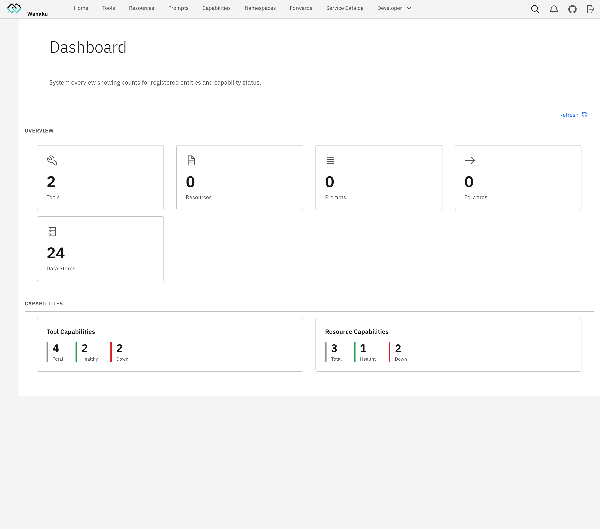

# Wanaku - A MCP Router that connects everything

[](LICENSE)
[](https://github.com/wanaku-ai/wanaku/actions)
[](https://github.com/wanaku-ai/wanaku/releases)

The Wanaku MCP Router is a router for AI-enabled applications powered by the [Model Context Protocol (MCP)](https://modelcontextprotocol.io/).

This protocol is an open protocol that standardizes how applications provide context to LLMs.

The project name comes from the origins of the word [Guanaco](https://en.wikipedia.org/wiki/Guanaco), a camelid native to
South America.

## Key Features

- **Unified Access** - Centralized routing and resource management for AI agents
- **MCP-to-MCP Bridge** - Act as a gateway or proxy for other MCP servers
- **Extensive Connectivity** - Leverage 400+ Apache Camel components for integration
- **Secure by Default** - Built-in authentication and authorization via Keycloak (optional — can run without auth)
- **Kubernetes-Native** - First-class support for OpenShift and Kubernetes deployments
- **Extensible Architecture** - Easy to add custom tools and resource providers
- **Multi-Namespace Support** - Organize tools and resources across isolated namespaces

## Quick Start

Getting started is a single command. Download the CLI from [releases page](https://github.com/wanaku-ai/wanaku/releases), unpack, 
and then just run:

```shell
wanaku start local
```

Access <http://localhost:8080> to enter the dashboard:



### Learn Wanaku

The easiest way to learn Wanaku is by following the [guided tutorial](https://wanaku.ai/docs/demos/).

### Basic Usage

The reference documentation, including the complete installation and configuration instructions, is available on the [Usage Guide](https://wanaku.ai/docs/version/).

## Documentation

The **[Wanaku Documentation](https://wanaku.ai/docs/)** website contains additional documentation, covering several of 
components that are part of the project - some of which are hosted in different repositories (i.e.: such as the 
[Camel Integration Capability](https://github.com/wanaku-ai/camel-integration-capability/), 
the [Java SDK](https://github.com/wanaku-ai/wanaku-capabilities-java-sdk/), etc.). 

## Community

- [GitHub Issues](https://github.com/wanaku-ai/wanaku/issues) - Bug reports and feature requests
- [Discussions](https://github.com/wanaku-ai/wanaku/discussions) - Ask questions and share ideas
- [Examples](https://github.com/wanaku-ai/wanaku-examples) - Example capabilities and integrations

Contributors working on the project may want to refer to the [development version of the documentation](/docs) including 

- **[Pre-release Usage Guide](docs/usage.md)** - Pre-release usage guide
- **[Architecture](docs/architecture.md)** - System architecture and components
- **[Building](docs/building.md)** - Build and package the project
- **[Contributing](CONTRIBUTING.md)** - Contribution guidelines
- **[Security](SECURITY.md)** - Security policy and best practices


## License

This project is licensed under the Apache 2.0 License - see the [LICENSE](LICENSE) file for details.
