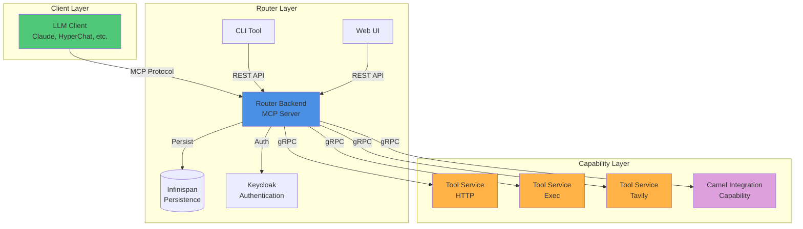
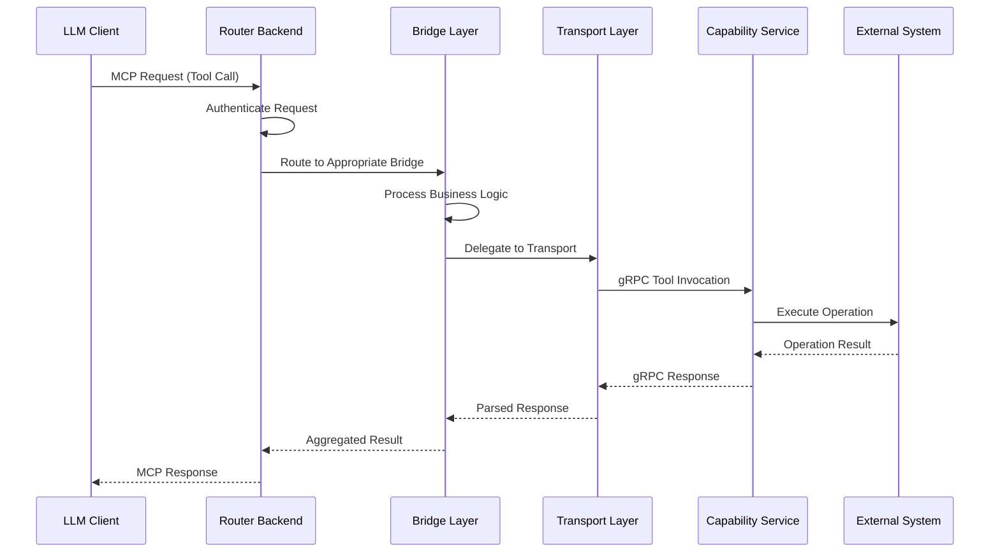
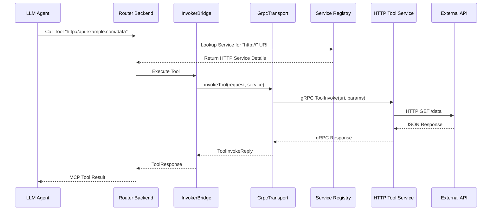
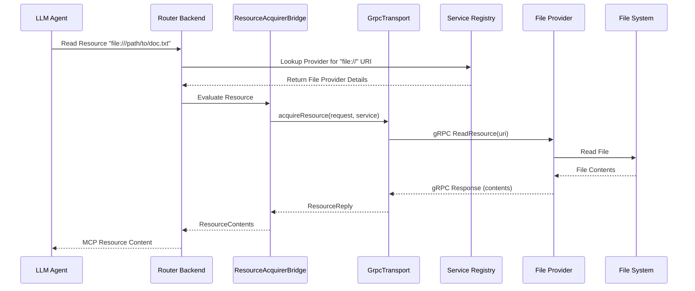
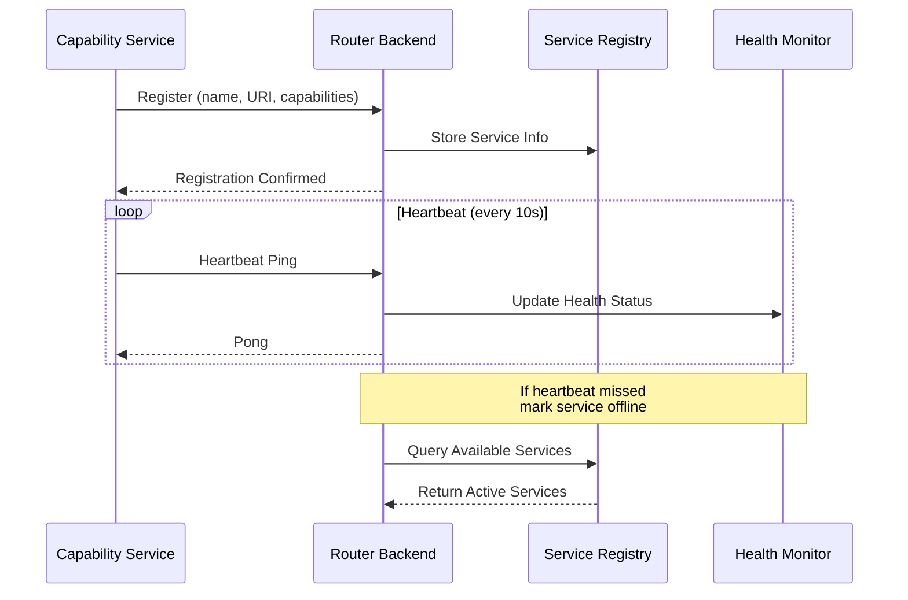
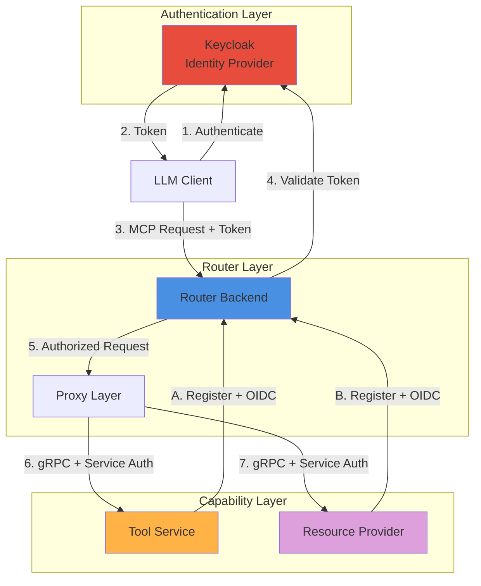
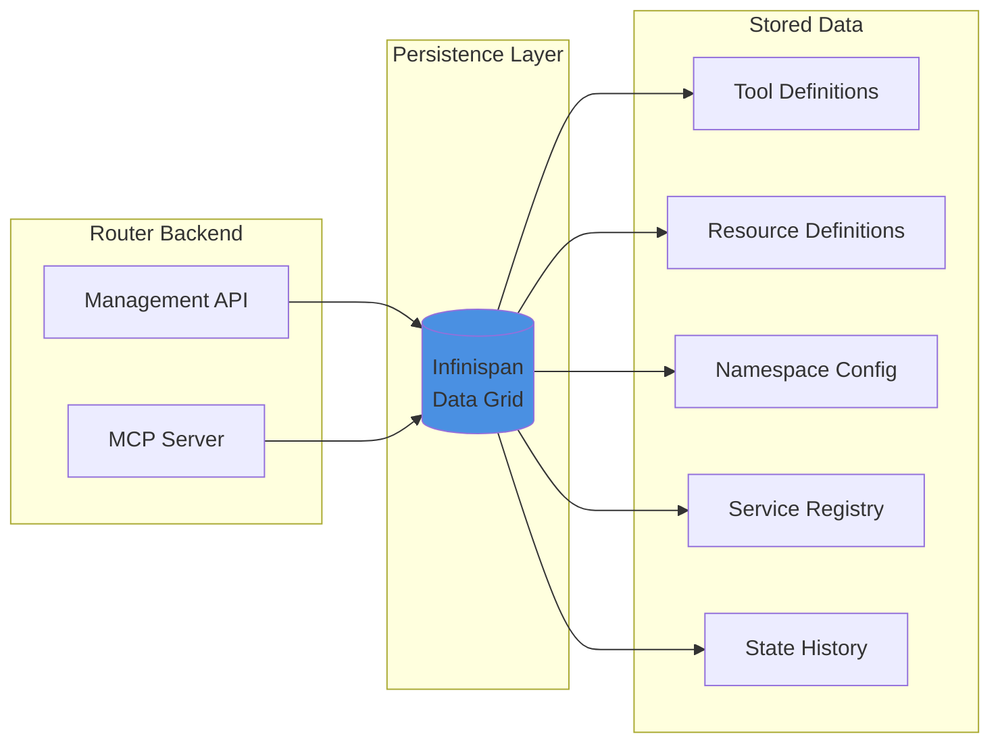
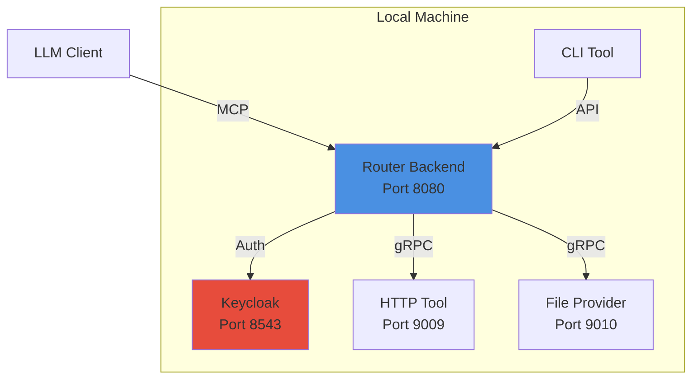
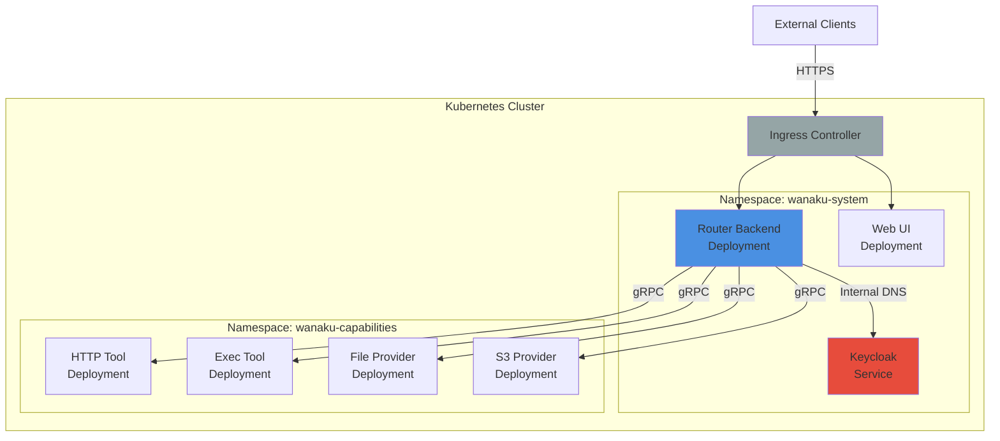

# Wanaku MCP Router Architecture

## Overview

The Wanaku MCP Router is a distributed system for managing Model Context Protocol (MCP) workloads, providing a flexible and extensible framework for integrating AI agents with enterprise systems and tools.

### Key Architectural Principles

- **Separation of Concerns**: Router backend handles protocol and routing; capability services handle actual operations
- **Service Isolation**: Each capability runs independently for security and reliability
- **Protocol Abstraction**: MCP protocol details are handled by the router; services focus on business logic
- **Dynamic Discovery**: Services register themselves at runtime, enabling flexible deployment

### High-Level Architecture

Wanaku doesn't directly host tools or resources. Instead, it acts as a central hub that manages and governs how AI agents access specific resources and capabilities through registered services.

The router uses a **bridge architecture** with **composition over inheritance** to separate transport concerns from business logic, enabling flexible and testable implementations.

> [!NOTE]
> For detailed information about the router's internal implementation, including the bridge pattern and transport abstraction, see [Wanaku Router Internals](wanaku-router-internals.md).

## System Components

### Core Router Components

#### Router Backend (`wanaku-router-backend`)

The main MCP server engine that:
- Receives MCP protocol requests from AI clients (SSE and HTTP transports)
- Routes tool invocations to appropriate tool services via gRPC
- Routes resource read requests to appropriate providers via gRPC
- Manages tool and resource registrations across namespaces
- Provides HTTP management API for configuration
- Handles authentication and authorization via Keycloak

**Technology Stack**: Quarkus, Quarkus MCP Server Extension, gRPC, Infinispan

#### CLI (`cli`)

Command-line interface for router configuration and management:
- Tool and resource management
- Namespace configuration
- Capability service monitoring
- Project scaffolding for new capabilities
- OAuth 2.0/OIDC authentication

#### Web UI (`ui`)

React-based administration interface:
- Visual tool and resource management
- Capability service status monitoring
- Configuration management
- User authentication via Keycloak

### Capability Services

Capability services extend the router's functionality by providing specific tools or resource access.

#### Tool Services

Tool services provide LLM-callable capabilities through the MCP protocol:

| Service | Purpose | Technology |
|---------|---------|------------|
| **HTTP Tool Service** | Make HTTP requests to REST APIs and web services | Apache Camel |
| **Exec Tool Service** | Execute system commands and processes | Native execution |
| **Tavily Tool Service** | Search integration through Tavily API | Tavily SDK |

#### Resource Providers

Resource providers enable access to different data sources and storage systems. 

Wanaku does not come with any resource provider out of the box,
but you can find some in the [Wanaku Examples repository](https://github.com/wanaku-ai/wanaku-examples).

### Core Libraries

Shared libraries providing foundational functionality:

| Library | Purpose |
|---------|---------|
| **core-exchange** | gRPC protocols and message exchange definitions |
| **core-mcp** | MCP protocol implementation and client libraries |
| **core-capabilities-base** | Base classes for capability implementations |
| **core-service-discovery** | Service registration and health monitoring |
| **core-persistence** | Data persistence abstractions with Infinispan |

### Development Tools

| Tool | Purpose |
|------|---------|
| **Archetypes** | Maven archetypes for creating new capabilities |
| **MCP Servers** | Specialized MCP server implementations for bridging |

## Architecture Patterns

### Distributed Microservices Architecture

Wanaku follows a distributed microservices architecture where the central router coordinates with independent provider and tool services:

- **Router as Gateway**: Central entry point for all MCP requests
- **Service Independence**: Each capability service runs as an independent process
- **Protocol Translation**: Router handles MCP protocol; services use gRPC
- **Horizontal Scalability**: Services can be scaled independently

### Request Flow

**Flow Steps:**

1. **Client Connection**: LLM client connects to router backend via MCP protocol (SSE or HTTP)
2. **Authentication**: Router authenticates the request using Keycloak/OIDC
3. **Request Processing**: Router receives MCP requests (tool calls, resource reads, prompt requests)
4. **Bridge Routing**: Bridge layer determines the appropriate service based on tool/resource type and namespace
5. **Business Logic**: Bridge processes request and prepares for transport
6. **Transport Delegation**: Bridge delegates communication to transport layer (composition pattern)
7. **gRPC Communication**: Transport forwards request to specific capability service via gRPC
8. **Service Processing**: Capability service handles actual resource access or tool execution
9. **Response Aggregation**: Results are returned through transport and bridge layers back to client

### Tool Invocation Flow

### Resource Read Flow

### Service Discovery and Registration

The router maintains a dynamic service registry that tracks available capability services.

**Registration Process:**

1. **Service Startup**: Capability service starts and loads configuration
2. **Authentication**: Service authenticates with router using OIDC client credentials
3. **Registration**: Service registers itself with router, providing:
   - Service name and type
   - gRPC endpoint address
   - Supported capabilities (tool types or resource protocols)
   - Configuration schema
4. **Health Monitoring**: Service sends periodic heartbeats to indicate availability
5. **Dynamic Discovery**: Router updates service registry and makes capabilities available
6. **Deregistration**: Service deregisters on shutdown or is marked offline after missed heartbeats

### Namespace Isolation

Namespaces provide logical isolation for organizing tools and resources:

- **Default Namespace**: Standard workspace for general-purpose tools and resources
- **Custom Namespaces** (ns-1 through ns-10): Isolated environments for specific use cases
- **Public Namespace**: Read-only access to shared tools and resources
- **Isolation**: Tools and resources in one namespace are not visible to clients connected to another

### Security Architecture

**Security Layers:**

1. **Client Authentication**: LLM clients authenticate via OIDC with Keycloak
2. **Token Validation**: Router validates access tokens for each request
3. **Service-to-Service Auth**: Capability services use client credentials to authenticate with router
4. **RBAC** (Future): Role-based access control for fine-grained permissions
5. **Provisioning Security**: Sensitive configuration delivered via encrypted channels

### Data Persistence

Wanaku uses Infinispan embedded data grid for persistence:

- **Tool Definitions**: Registered tools with URIs, labels, and configuration
- **Resource Definitions**: Registered resources with URIs and metadata
- **Namespace Configuration**: Namespace settings and mappings
- **Service Registry**: Active capability services and their health status
- **State History**: Historical snapshots for rollback and auditing (configurable retention)

### Extensibility Model

New capabilities can be added through multiple approaches:

#### 1. Tool Services

**Steps:**
1. Use `wanaku services create tool --name my-tool` to generate project
2. Implement tool logic using Java/Camel or other gRPC-capable language
3. Configure service registration and OIDC credentials
4. Deploy service (standalone or containerized)
5. Service auto-registers with router on startup

#### 2. Resource Providers

Similar pattern to tool services, using `wanaku services create provider`

#### 3. MCP Server Bridging

Wanaku can aggregate external MCP servers, presenting them as unified capabilities.

#### 4. Apache Camel Integration

Leverage 300+ Camel components for rapid integration:
- Kafka, RabbitMQ, ActiveMQ
- AWS, Azure, Google Cloud services
- Databases (SQL, MongoDB, etc.)
- Enterprise systems (SAP, Salesforce, etc.)

## Design Decisions

### Why gRPC for Internal Communication?

- **Performance**: Binary protocol with efficient serialization
- **Type Safety**: Strongly-typed contracts via Protocol Buffers
- **Streaming**: Built-in support for bidirectional streaming
- **Language Agnostic**: Capability services can be written in any language

### Why Separate Router and Capability Services?

- **Isolation**: Failures in one capability don't affect others
- **Independent Scaling**: Scale services based on demand
- **Technology Flexibility**: Use different tech stacks per service
- **Security**: Contain potential vulnerabilities to specific services

### Why Bridge Pattern with Composition?

- **Separation of Concerns**: Business logic separated from transport implementation
- **Testability**: Easy to mock transport layer for unit testing
- **Flexibility**: Support multiple transport protocols (gRPC, HTTP, WebSocket)
- **Maintainability**: Changes to transport don't affect business logic
- **Extensibility**: New transport implementations without modifying bridges

### Why Infinispan for Persistence?

- **Embedded**: No external database dependency for simple deployments
- **Performance**: In-memory data grid with fast access
- **Clustering**: Supports distributed deployments (future)
- **ACID**: Transactional consistency for critical operations

## Deployment Architectures

### Local Development

**Characteristics:**
- All components run on localhost
- Simple podman/docker setup for Keycloak
- Easy debugging and development
- No network complexity

### Kubernetes/OpenShift Deployment

**Characteristics:**
- Production-grade deployment
- Service discovery via Kubernetes DNS
- Horizontal pod autoscaling
- ConfigMaps and Secrets for configuration
- Health checks and rolling updates

## Performance Considerations

### Throughput

- **MCP Requests**: Router handles concurrent requests asynchronously
- **gRPC**: Efficient binary protocol reduces serialization overhead
- **Connection Pooling**: Reuses gRPC connections to capability services
- **Async Processing**: Non-blocking I/O throughout the stack

### Latency

Typical request latency breakdown:

| Component | Latency | Notes |
|-----------|---------|-------|
| MCP Protocol Overhead | ~5ms | SSE/HTTP serialization |
| Router Processing | ~10ms | Routing, auth validation |
| gRPC Communication | ~2ms | Internal network |
| Capability Processing | Variable | Depends on operation |
| **Total (excluding operation)** | **~17ms** | Overhead without actual work |

### Scaling Strategies

1. **Vertical Scaling**: Increase router resources for higher throughput
2. **Horizontal Scaling**: Multiple router instances behind load balancer (future)
3. **Capability Scaling**: Scale individual services based on demand
4. **Caching**: Infinispan caching reduces repeated lookups

## Related Documentation

- **[Wanaku Router Internals](wanaku-router-internals.md)** - Deep dive into proxy architecture and implementation
- **[Configuration Guide](configurations.md)** - Complete configuration reference
- **[Contributing Guide](../CONTRIBUTING.md)** - How to extend Wanaku with new capabilities
- **[Security Guide](../SECURITY.md)** - Security best practices and policies
- **[Usage Guide](usage.md)** - Operational guide for using Wanaku