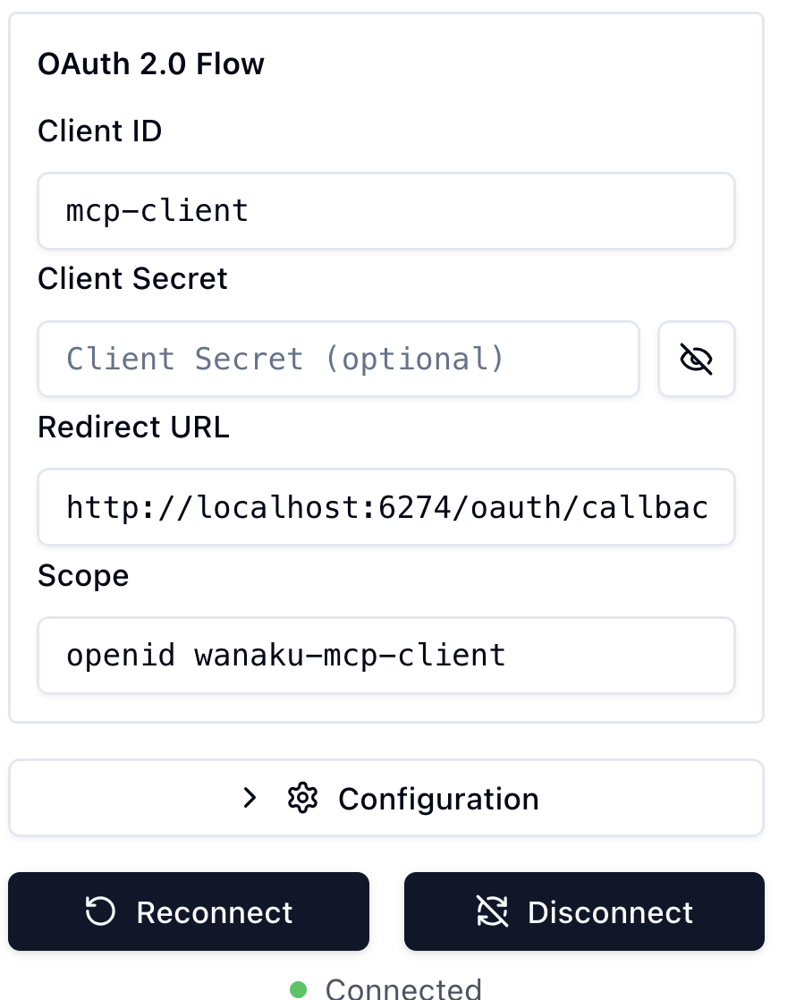

# Contributing

## Tools and Providers 

A tool is anything that can operate in a request/reply mode.
A provider is anything that can read a resource.
Tools typically mean that some processing is performed on the provided input. 
Providers typically facilitate access to a resource (such as file) without necessarily processing an input (except, of course, 
evaluating the name of the resource and how that matches with the underlying system storing the resource).

Here are some examples: 

* Producing a record to Kafka and waiting for a response in another topic is a tool
* Reading the last record on a Kafka topic is a provider 
* Running an SQL query on a database is a tool (i.e., the query is the request, and returned rows are the response).
* Reading a data object in a S3 bucket is a provider 
* Exchanging data using request/reply over JMS is a tool

> [!NOTE]
> This is a generic explanation and the distinction may be specific to the problem domain. 
> Therefore, there may be cases where this doesn't apply.

Ideally, most of the MCP tools and MCP resource providers should be created using the 
[Camel Integration Capability for Wanaku](https://wanaku.ai/docs/camel-integration-capability/).
For special cases, you can use the Wanaku CLI to create the project templates for creating tools or resource providers using 
the Wanaku SDK.


> [IMPORTANT]
> The vast majority of the custom capabilities should be included in the [Wanaku Examples](https://github.com/wanaku-ai/wanaku-examples)
> repository and not to the main Wanaku MCP Router project.


### Service types

You can create services using [Apache Camel](https://camel.apache.org) or plain [Quarkus](https://quarkus.io). To do so, just 
provide the desired type when creating the project (i.e.; via `--type=quarkus` when using `wanaku` or `-Dwanaku-capability-type` when 
using the Maven archetype).

## Creating New Tools

To create a new tool for Wanaku, you can start by creating a new project. 

For instance, to create one for Kafka:

```shell
wanaku services create tool --name kafka
```

> [!NOTE]
> This can be used both to create a core tool, part of the Wanaku MCP router project,
> or to create a custom one for your own needs. Also, this is the **recommended** way to 
> create a new component for Wanaku.

### Creating New Tools Using Maven

Alternatively, if you don't have the CLI instanced, you can do so using Maven:
 
```shell
mvn -B archetype:generate -DarchetypeGroupId=ai.wanaku -DarchetypeArtifactId=wanaku-tool-service-archetype \ 
  -DarchetypeVersion=0.0.8 -DgroupId=ai.wanaku -Dpackage=ai.wanaku.tool.kafka -DartifactId=wanaku-tool-service-kafka \
  -Dname=Kafka -Dwanaku-version=0.0.8 -Dwanaku-capability-type=camel
```

> [!IMPORTANT]
> When using the maven way, please make sure to adjust the version of Wanaku
> to be used by correctly setting the `wanaku-version` property to the base Wanaku version to use.

### Adjusting the Tool Service

After creating the service, open the `pom.xml` file to add the dependencies for your project. 
Using the example above, we would include the following dependencies:

```xml
    <dependency>
        <groupId>org.apache.camel.quarkus</groupId>
        <artifactId>camel-quarkus-kafka</artifactId>
    </dependency>
```

Adjust the gPRC port in the `application.properties` file by adjusting the `quarkus.grpc.server.port` property.

> [!NOTE]
> You can also provide the port when launching 
> (i.e., `java -Dquarkus.grpc.server.port=9190 -jar target/quarkus-app/quarkus-run.jar`)

Then, build the project:

```shell
mvn clean package
```

And run it: 

```shell
java -jar target/quarkus-app/quarkus-run.jar
```

## Creating new Resource Providers

To create a new resource for Wanaku, you can start by creating a new project. 

For instance, to create one for S3:

```shell
wanaku services create resource --name s3
```

> [!NOTE]
> This can be used both to create a core tool, part of the Wanaku MCP router project,
> or to create a custom one for your own needs. Also, this is the **recommended** way to
> create a new component for Wanaku.

### Creating New Resource Providers Using Maven

Alternatively, if you don't have the CLI instanced, you can do so using Maven:

```shell
mvn -B archetype:generate -DarchetypeGroupId=ai.wanaku -DarchetypeArtifactId=wanaku-provider-archetype \
  -DarchetypeVersion=0.0.8 -DgroupId=ai.wanaku -Dpackage=ai.wanaku.provider.s3 -DartifactId=wanaku-provider-s3 \
  -Dname=S3 -Dwanaku-version=0.0.8 -Dwanaku-capability-type=camel
```

> [!IMPORTANT]
> Make sure to adjust the version of Wanaku to be used by correctly setting the `wanaku-version` property to the base Wanaku 
> version to use.

### Adjusting the Provider Service

After creating the service, open the `pom.xml` file to add the dependencies for your project.
Using the example above, we would include the following dependencies:

```xml
<dependency>
    <groupId>org.apache.camel.quarkus</groupId>
    <artifactId>camel-quarkus-aws-s3</artifactId>
</dependency>
```

Adjust the gPRC port in the `application.properties` file by adjusting the `quarkus.grpc.server.port` property.

> [!NOTE] 
> You can also provide the port when launching (i.e., `java -Dquarkus.grpc.server.port=9190 -jar target/quarkus-app/quarkus-run.jar`)

Then, build the project:

```shell
mvn clean package
```

And run it:

```shell
java -jar target/quarkus-app/quarkus-run.jar
```

## Building Containers


You can also build containers using:

```shell
mvn -Pdist -Dquarkus.container-image.build=true -Dquarkus.container-image.push=true clean package
```

For custom containers, please make sure you set the following properties
* `quarkus.container-image.registry`: to set the registry name
* `quarkus.container-image.group`: to set the grop

You can do that in the `pom.xml` file:

```xml
<project> 
    <!-- lots of stuff --> 
    <properties>
        <quarkus.container-image.registry>quay.io</quarkus.container-image.registry>
        <quarkus.container-image.group>my-group</quarkus.container-image.group>
    </properties>
    <!-- lots of other stuff -->
</project>
```

Or in the CLI:

```shell
mvn -Pdist -Dquarkus.container-image.registry=quay.io -Dquarkus.container-image.group=my-group -Dquarkus.container-image.build=true -Dquarkus.container-image.push=true clean package
```

## Capabilities and Forwards 

Wanaku supports acting as a router/gateway for two types of services: 

* Downstream services using gRPC. These services can either be plain Quarkus or Camel Extension for Quarkus.
* Other HTTP-based MCP servers (SSE). This allows integrating any MCP server with Wanaku.

The type of service you create will depend on the type of problem you want to solve. Downstream services ofter
greater integration with Wanaku (i.e.; including better discovery and configuration). On the other hand, plain MCP
services are simpler to create and develop. 

### Capabilities Services Tips

### Adding Routes to Providers and Tools

In some cases, you may need something more complex than can be achieved using the `ProducerTemplate` from Camel.
In those cases, then you can create a traditional Camel route and invoke it from the delegate. 

The example below shows a route that consumes from `direct:start` and sets a body as the reply:

```java
package ai.wanaku.tool;

import org.apache.camel.builder.RouteBuilder;

public class ExampleRoute extends RouteBuilder {
	@Override
    public void configure() throws Exception {
        from("direct:start")
                .log("Hello World ${body}")
                .setBody(constant("It worked!"));
    }
}
```

Then, on the delegate code, you should call that route using: 

```java
String s = producer.requestBody("direct:start", parsedRequest.body(), String.class);
```

That should allow you to run more complex processing and transformation before calling the endpoint.

## Running Keycloak for Development

To run keycloak for development: 

```shell
podman run -d \
  --name keycloak \
  -p 127.0.0.1:8543:8080 \
  -e KC_BOOTSTRAP_ADMIN_USERNAME="admin" \
  -e KC_BOOTSTRAP_ADMIN_PASSWORD="admin" \
  -v keycloak-data:/opt/keycloak/data \
  quay.io/keycloak/keycloak:26.3.4 \
  start-dev
```

If it is the first time you are using it, you will need to configure Wanaku's realm: 

```shell
export WANAKU_KEYCLOAK_PASS=admin
export WANAKU_KEYCLOAK_HOST=localhost:8543
cd deploy/auth
./configure-auth.sh
```

Then, take note of the newly generated client secret and use that for the capabilities services. 

### Authentication Configuration

#### Using a Static Client 



#### Using Dynamic Client Registration

What the [](https://www.youtube.com/watch?v=44j6025ewTA)
video that shows how to use the MCP Inspector to perform these steps.

## Testing

There are multiple ways you can test Wanaku and the integrations you develop. 

1. Wanaku's LLMchat page in the Web UI
2. You can use the [MCP inspector](https://modelcontextprotocol.io/docs/tools/inspector) to easily test your tool or provider.
3. Any of the scripts in the `tests` directory 
4. Any agent application (such as [HyperChat](https://github.com/BigSweetPotatoStudio/HyperChat)) 

## Release Guide

Committers should check the [Release Guide](release-guide) for details about how to build and distribute Wanaku.

## Learn More

To contribute new core features and connectors, also read the [Wanaku MCP Router Internals](wanaku-router-internals.md) guide.

If you want to understand what each of the components do, then read the [Wanaku Components and Architecture](architecture.md) guide.