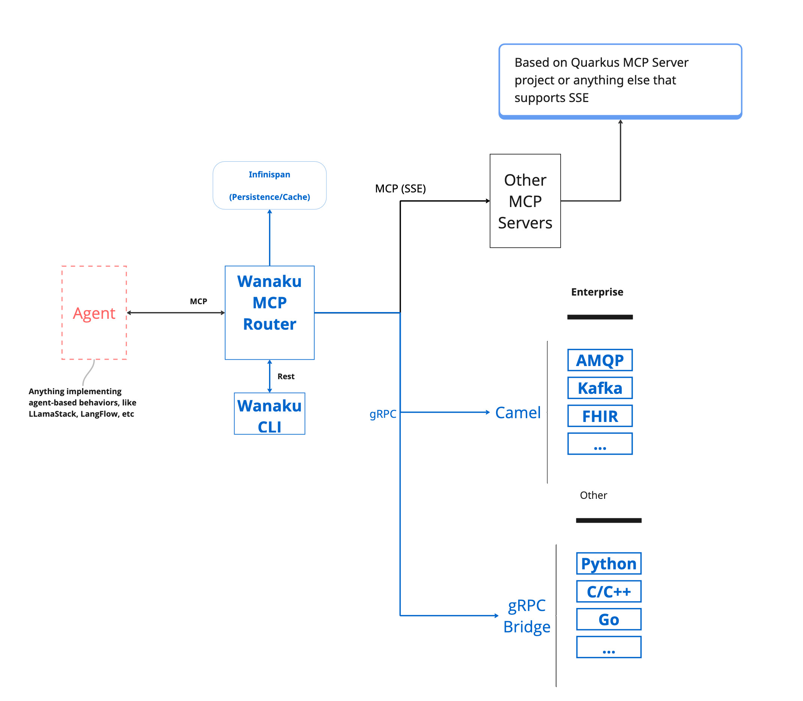
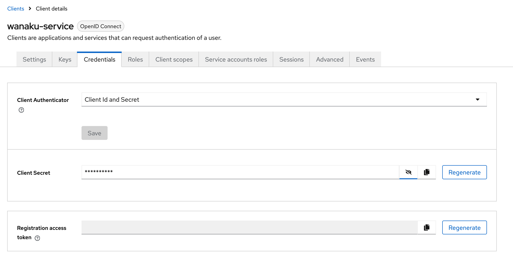
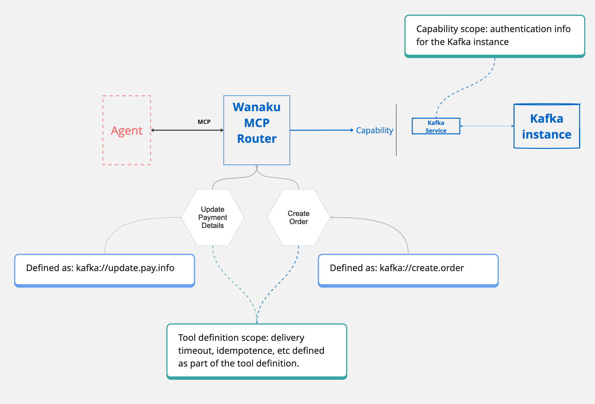
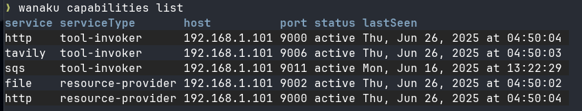
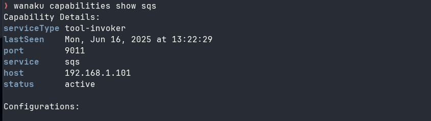
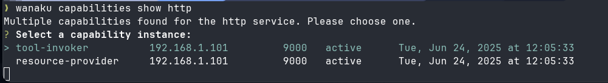
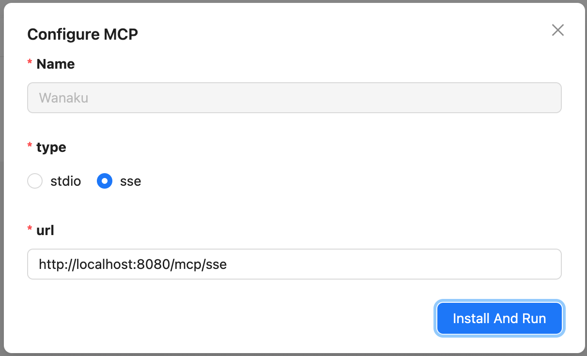

# Introduction

Wanaku aims to provide unified access, routing and resource management capabilities for your organization and your AI Agents.

## Understanding What Is Wanaku

The Wanaku MCP Router is an integration service designed to securely connect AI agents with various enterprise systems and cloud services.
It acts as a central hub that manages and governs how agents access specific resources and tools, effectively proxying and
filtering capabilities exposed to Large Language Models (LLMs).

The Wanaku MCP Router itself does not directly host tools or resources; instead, it acts as an integration service that connects AI agents with external resources and tools, including enterprise systems and cloud services. It manages and governs access between agent types and specific resources, proxying and filtering available capabilities to agents and their LLM



Wanaku provides specialized services, referred to as "capabilities" that offer specific functionalities to the Wanaku MCP Router.

These capabilities enable communication with various systems, such as Kafka services, message brokers, cloud services (AWS, Azure, Google, etc.),
databases and a wide range of enterprise systems, including Workday and Salesforce, without directly containing the tools or resources.

Furthermore, Wanaku features an MCP-to-MCP bridge, which allows it to act as a centralized gateway or proxy for other MCP servers
that use HTTP as the transport mechanism. This capability enables Wanaku to aggregate and effectively "hide" multiple external MCP
servers, simplifying management and increasing the overall functionality of a Wanaku instance. Wanaku is an open-source project and is licensed under Apache 2.0.

### Meet Wanaku 

If you haven't seen it already, we recommend watching the Getting Started with Wanaku video that introduces the project, 
and introduces how it works.

[](https://www.youtube.com/watch?v=-fuNAo2j4SA)

> [!NOTE]
> Also check the Getting Started from the [demos repository](https://github.com/wanaku-ai/wanaku-demos/tree/main/01-getting-started).

## Using Wanaku

Using Wanaku MCP Router involves three key actions:

1. Adding tools or resources to the MCP router
2. Forwarding other MCP servers via the MCP forwarder 
3. Adding new capabilities via downstream services

### Adding tools or resources that use those capabilities

Adding tools and resources to the Wanaku MCP Router expands the functionality available to agents using Wanaku. 

* MCP tools equip an agent with capabilities not inherently present in its native models. 
* MCP resources, on the other hand, allow an AI agent to consume data—such as files or records—and inject additional information into its context.

Both tools and resources depend on capabilities that can be dynamically added to or removed from the Wanaku MCP Router. 
Once these capabilities are integrated, either through downstream services or by connecting to other MCP servers, users can then 
incorporate new tools and resources into Wanaku. 
These additions can then leverage the newly integrated capabilities to interact with enterprise systems and cloud services.

### Forwarding other MCP servers via the MCP forwarder

Wanaku can act as a central gateway or proxy to other MCP servers that use HTTP as the transport mechanism.
This feature allows for a centralized endpoint to aggregate tools and resources provided by other MCP servers, making them 
accessible as if they were local to the Wanaku instance.

### Adding new capabilities via downstream services

This refers to extending the router's functionality by integrating with various external systems.

Wanaku leverages Quarkus and Apache Camel to provide connectivity to a vast range of services and platforms.
This allows users to create custom services to solve particular needs.
These services can be implemented in any language that supports gRPC for communication with the Wanaku MCP Router.

> [!NOTE]
> It is also possible to create and run services in Java and other languages, such as Go or Python, although the process is not
> entirely documented at the moment.

# Preparing the System for Running Wanaku 

Security in Wanaku involves controlling access to the management APIs and web interface while ensuring that only authorized
users can modify tools, resources, and configurations. Wanaku also ensures secure access to the MCP tools and resources. 

Wanaku uses [Keycloak](https://keycloak.org) for authentication and authorization. As such, a Keycloak instance needs to be up
and running for Wanaku to work. This section covers the basics of getting Keycloak ready for Wanaku for development and production 
purposes.

## Keycloak Setup for Wanaku

Choose the setup that matches your environment.

* **Local Development:** Use Podman for a quick, local instance.
* **OpenShift Deployment:** Follow these steps for a cluster environment.

### Option 1: Local Setup with Podman

This method is ideal for development and testing on your local machine.

#### Starting the Keycloak Container

First, run the following command in your terminal to start a Keycloak container.
This command also sets the initial admin credentials and maps a local volume for data persistence.

```shell
podman run -d \
  -p 127.0.0.1:8543:8080 \
  -e KC_BOOTSTRAP_ADMIN_USERNAME=admin \
  -e KC_BOOTSTRAP_ADMIN_PASSWORD=admin \
  -v keycloak-dev:/opt/keycloak/data \
  quay.io/keycloak/keycloak:26.3.5 start-dev
```

* `-p 127.0.0.1:8543:8080`: Maps port `8543` on your local machine to the container's port `8080`. By default, Wanaku expects Keycloak on port `8543`.
* `-e ...`: Sets the default **admin** username and password. Change the password for any non-trivial use case.
* `-v keycloak-dev...`: Creates a persistent volume named `keycloak-dev` to store Keycloak data.

### Option 2: Deploying to OpenShift or Kubernetes

If you are deploying Wanaku in OpenShift or Kubernetes, you can follow these steps to get an entirely new Keycloak setup up and
running.
If you already have a Keycloak instance, you may skip the deployment section and jump to importing the realm.

#### Deploying Keycloak

Apply the pre-defined Kubernetes configurations located in the [`deploy/auth`](https://github.com/wanaku-ai/wanaku/tree/main/deploy/auth) directory.
This will create all the necessary resources for Keycloak to run.

> [!IMPORTANT]
> Before applying, review the files and be sure to change the default admin password for security.

```shell
oc apply -f deploy/auth
```

### Importing the Wanaku Realm Configuration (via CLI)

Next, you'll use Keycloak's Admin API to automatically configure the `wanaku` realm.
Wanaku comes with a [script that simplifies importing](https://github.com/wanaku-ai/wanaku/blob/main/deploy/auth/configure-auth.sh)
the realm configuration into keycloak. 

To run that script: 
- set the `WANAKU_KEYCLOAK_PASS` variable to the admin password of your Keycloak instance
- set `WANAKU_KEYCLOAK_HOST` to the address of your Keycloak instance (i.e.; `localhost` if using Podman or the result of `oc get routes keycloak -o json  | jq -r .spec.host` if using OpenShift)


### Importing the Wanaku Realm Configuration (via Keycloak UI)

Alternatively, you may also import the configuration using Keycloak's UI, and then proceed to regenerate the capabilities' client secret. 

#### Regenerating the Capabilities' Client Secret

Finally, for security, you must regenerate the client secret for the `wanaku-service` client.

1.  Navigate to the Keycloak Admin Console at `http://localhost:8543`.
2.  Log in with your admin credentials (**admin**/**admin**).
3.  Select the **wanaku** realm from the dropdown in the top-left corner.
4.  Go to **Clients** in the side menu and click on **wanaku-service**.
5.  Go to the **Credentials** tab.
6.  Click the **Regenerate secret** button and confirm. Copy the new secret to use in your application's configuration.



# Installing Wanaku

To run Wanaku, you need to first download and install the router and the command line client.

## Installing the Command Line Interface (CLI)

Although the router comes with a UI, the CLI is the primary method used to manage the router. 
As such, it's recommended to have it installed.

#### Installing the CLI by downloading binary

The most recommended method for installing the Wanaku CLI is to download the latest version directly from the
[release](https://github.com/wanaku-ai/wanaku/releases) page on GitHub

#### Installing the CLI via JBang

To simplify using the Wanaku Command Line Interface (CLI), you can install it via [JBang](https://www.jbang.dev/).

First, ensure JBang is installed on your system. You can find detailed [download and installation](https://www.jbang.dev/download/) instructions on the official JBang website.

After installing JBang, verify it's working correctly by opening your command shell and running:

```shell
jbang version
```

This command should display the installed version of JBang.

Next, to access the Wanaku CLI, install it using JBang with the following command:

```shell
jbang app install wanaku@wanaku-ai/wanaku
```
This will install Wanaku CLI as the `wanaku` command within JBang, meaning that you can run Wanaku from the command line by just
executing `wanaku`.

> [!NOTE]
> It requires access to the internet, in case of using a proxy, please ensure that the proxy is configured for your system.
> If Wanaku JBang is not working with your current configuration, please look to [Proxy configuration in JBang documentation](https://www.jbang.dev/documentation/jbang/latest/configuration.html#proxy-configuration).

## Installing and Running the Router

There are three ways to run the router. They work similarly, with the distinction that some of them may come with more 
capabilities by default — continue reading the documentation below for details.

> [!IMPORTANT]
> Before the router can be executed, it still needs to be configured for secure access and control of its resources. Make sure 
> you read the section [Securing the Wanaku MCP Router](# Securing the Wanaku MCP Router) **before** running or deploying the router. 

### Installing and Running Wanaku Locally Using "Wanaku Start Local"

You can use the Wanaku CLI to start a small/simplified local instance. To do so, you need to run and configure a local Keycloak 
instance and then use the `wanaku start local` command to run Wanaku pointing to that instance. Make sure you follow the steps
described in [Option 1: Local Setup with Podman](## Option 1: Local Setup with Podman) the [Keycloak Setup For Wanaku](#Keycloak Setup for Wanaku).

After downloading the CLI, simply run `wanaku start local` and the CLI should download, deploy and start Wanaku with the main
server, a file provider and an HTTP provider. You will need to pass the client secret configured 
so that the capabilities can connect to the router. 

```wanaku start local start local --capabilities-client-secret=aBqsU3EzUPCHumf9sTK5sanxXkB0yFtv```

If that is successful, open your browser at http://localhost:8080, and you should have access to the UI.

> [!NOTE]
> You can use the command line to enable more services by using the `--services` option. Use the `--help` to see the details. 

### Installing and Running Wanaku on OpenShift or Kubernetes Using the Wanaku Operator

The Wanaku Operator simplifies the deployment and management of Wanaku instances on Kubernetes and OpenShift clusters.
It automates the creation and configuration of all necessary resources, making it the recommended approach for production deployments.

#### Prerequisites

Before deploying the Wanaku Operator, ensure you have:
- Access to a Kubernetes or OpenShift cluster
- `kubectl` or `oc` CLI tools installed and configured
- `helm` CLI tool installed (version 3.x or later)
- A running Keycloak instance (see [Keycloak Setup for Wanaku](#keycloak-setup-for-wanaku))
- Sufficient permissions to create namespaces, deployments, and custom resources

#### Installing the Wanaku Operator with Helm

The Wanaku Operator can be deployed using Helm charts. First, ensure you're in the correct namespace or create a new one:

```shell
kubectl create namespace wanaku
```

Then, install the operator using the [Helm chart](https://github.com/wanaku-ai/wanaku/tree/main/wanaku-operator/deploy/helm) from the repository:

```shell
helm install wanaku-operator ./wanaku-operator/deploy/helm/wanaku-operator \
  --namespace wanaku \
  --set operatorNamespace=wanaku
```

By default, the operator will be deployed in the namespace specified by the `operatorNamespace` value. 

You can customize this during installation:

```shell
helm install wanaku-operator ./wanaku-operator/deploy/helm/wanaku-operator \
  --namespace my-custom-namespace \
  --set operatorNamespace=my-custom-namespace
```

To verify the operator is running:

```shell
kubectl get pods -n wanaku
```

You should see the operator pod in a Running state.

#### Defining a Wanaku Router Instance

Once the operator is installed, you can create Wanaku router instances by defining a custom resource.
The operator watches for these custom resources and automatically creates all necessary Kubernetes objects.

Create a file named `wanaku-instance.yaml` with the following content:

```yaml
apiVersion: "wanaku.ai/v1alpha1"
kind: Wanaku
metadata:
  name: wanaku-dev
spec:
  auth:
    # This is the address of the authorization server (in the format: http://address)
    authServer: http://keycloak:8080
    # Address of the proxy (in the format: http://address).
    # It could be the same as the auth server (default) or "auto"
    # (for using Wanaku as the proxy via OIDC proxy)
    # authProxy: ""
  secrets:
    # This is the OIDC credentials secret for the services
    oidcCredentialsSecret: your-keycloak-client-secret

  # Router settings are optional
  router:
    # You can set a custom image for the router
    # image: quay.io/wanaku/wanaku-router-backend:latest
    env:
      # It is possible to set environment variables for the router
      # - name: ENVIRONMENT_VARIABLE_1
      #   value: value1
      # - name: ENVIRONMENT_VARIABLE_2
      #   value: value2

  # Define the capabilities you want to enable
  capabilities:
    # HTTP capability for HTTP-based tools
    - name: wanaku-http
      image: quay.io/wanaku/wanaku-tool-service-http:latest

    # Camel Integration Capability example
    - name: employee-system
      type: camel-integration-capability
      image: quay.io/wanaku/camel-integration-capability:latest
      env:
        # The path to the routes file, should be within /data
        - name: ROUTES_PATH
          value: "/data/employee-routes.camel.yaml"
        # The path to the rules file, should be within /data
        - name: ROUTES_RULES
          value: "/data/employee-rules.yaml"
```

Apply the custom resource to create your Wanaku instance:

```shell
kubectl apply -f wanaku-instance.yaml
```

The operator will automatically create:
- Deployment for the Wanaku router
- Deployments for each enabled capability
- Services to expose the router and capabilities
- ConfigMaps for configuration
- Secrets for sensitive data
- Routes/Ingress (if configured)
- ServiceAccounts and RBAC resources

> [!NOTE]
> When using the Camel Integration Capability, you can copy your route and rules files to the capability pods using:
> ```shell
> kubectl cp your-routes.camel.yaml <pod-name>:/data/employee-routes.camel.yaml
> ```

> [!TIP]
> You can find more complete examples in the [wanaku-operator/samples](https://github.com/wanaku-ai/wanaku/tree/main/wanaku-operator/samples) directory.

#### Checking the Deployment Status

To check the status of your Wanaku instance:

```shell
kubectl get wanaku -n wanaku
```

To view detailed information:

```shell
kubectl describe wanaku my-wanaku-router -n wanaku
```

To access the logs:

```shell
kubectl logs -n wanaku deployment/my-wanaku-router
```

#### Accessing the Wanaku Router

Once deployed, you can access the Wanaku router through its service. To get the service details:

```shell
kubectl get svc -n wanaku
```

To get the route URL:

```shell
oc get route my-wanaku-router -n wanaku -o jsonpath='{.spec.host}'
```

#### Updating the Wanaku Instance

To update your Wanaku instance, simply edit the custom resource and apply the changes:

```shell
kubectl edit wanaku my-wanaku-router -n wanaku
```

Or update your YAML file and reapply:

```shell
kubectl apply -f wanaku-instance.yaml
```

The operator will automatically handle the update and roll out the changes.

#### Removing the Wanaku Instance

To remove a Wanaku instance:

```shell
kubectl delete wanaku my-wanaku-router -n wanaku
```

To uninstall the operator:

```shell
helm uninstall wanaku-operator -n wanaku
```

> [!NOTE]
> The operator manages the entire lifecycle of Wanaku instances. Manual modifications to operator-managed resources
> may be overwritten by the operator's reconciliation process.

### Installing and Running Wanaku on OpenShift or Kubernetes (Manually - Deprecated)

It is also possible to manually run Wanaku on Kubernetes distributions, such as OpenShift. 
The deployment is configured using Kustomize for environment-specific customization.

The basic steps to install and run Wanaku on OpenShift are: 

1. Download the kustomize template files in the [`deploy` directory](https://github.com/wanaku-ai/wanaku/tree/main/deploy/openshift/kustomize) making sure to use the branch that matches your Wanaku version
2. Copy the files from the [`dev`](https://github.com/wanaku-ai/wanaku/tree/main/deploy/openshift/kustomize/overlays/dev) directory and use them to create a new overlay (i.e.: `prod`) 
3. Adjust the kustomize files according to your environment. 

> [!TIP]
> You may also consult [developer-specific documentation](https://github.com/wanaku-ai/wanaku/blob/main/deploy/openshift/kustomize/CONFIGMAP-USAGE.md)
> if you need special customizations to your deployment.

### Configuring the Wanaku MCP Router

You can find a comprehensive list of configuration options for Wanaku in the [Configuration Guide](configurations.md).

### Accessing the Administration Web User Interface 

Wanaku also comes with a web user interface that you can access to manage the router. By default it runs on port 8080 of
the host running the router. 

> [!NOTE]
> At this moment, some features are only available on the CLI.

When accessing the Web UI for the first time, you will be redirected to the Keycloak instance for login. Create a user
and define a password. 

> [!IMPORTANT]
> Wanaku does not yet support fine-grained control over its exposed resources. All users have admin access to the
> tools and resources exposed. Expect this to change in future versions.

## Installing and Running Capabilities

Capabilities are standalone services that connect to the Wanaku router to provide new functionalities. 
They can be downloaded from the [release page](https://github.com/wanaku-ai/wanaku/releases),
[deployed to OpenShift](https://github.com/wanaku-ai/wanaku/tree/main/deploy/openshift/kustomize) using [containers](https://quay.io/organization/wanaku)
or built from source.

To run a capability, you need to configure it to connect to your Wanaku router instance and authenticate with it.
This is done by setting a few essential properties.

### Configuring Capabilities

You can configure capabilities using environment variables or by passing system properties directly on the command line.

Here are the key properties you need to set:

1.  Router URI: Each capability needs to know where the Wanaku router is located to register itself.
    ```properties
    wanaku.service.registration.uri=http://localhost:8080
    ```

2.  OIDC Client Credentials: Capabilities authenticate with the router using OIDC. You must provide the client secret that you previously regenerated in Keycloak.
    ```properties
    quarkus.oidc-client.credentials.secret=your-client-secret-from-keycloak
    ```

3.  Announce Address (Optional): If the capability is running in an environment where its address is not directly accessible by the router (e.g., behind a NAT or in a container), you need to specify the address that the router should use to communicate back to it.
    ```properties
    wanaku.service.registration.announce-address=your-public-address
    ```

> [!TIP]
> You can check the full set of [configuration](configurations.md) available.

### Running a Capability

Once configured, you can run the capability from the command line. The following example shows how to run a capability while overriding the configuration properties:

```shell
java -Dwanaku.service.registration.uri=http://<wanaku-router-host>:8080 \
     -Dquarkus.oidc-client.credentials.secret=<your-client-secret> \
     -Dwanaku.service.registration.announce-address=<your-public-address> \
     -jar <capability-jar-file>.jar
```

> [!NOTE]
> Each capability may have its own specific set of configurations. For example, the [Camel Integration Capability for Wanaku](https://wanaku.ai/docs/camel-integration-capability/)
> requires additional properties to connect to different systems.
> Always consult the specific documentation for the capability you are using for more details.

#### Prerequisites

Before deploying Wanaku on OpenShift, ensure you have:
- Access to an OpenShift or Kubernetes cluster
- `oc` or `kubectl` CLI tools configured
- Sufficient permissions to create deployments, services, and routes

#### Initial Setup Steps

#### Deployment

You can deploy Wanaku in OpenShift or Kubernetes using Kustomize. 

After having deployed Keycloak, then run the following command to get its route:
 
```shell
oc get route keycloak -o jsonpath='{.spec.host}'
```

Lastly, copy the regenerated client secret and add it to the respective overlay:

```shell
oc apply -k deploy/openshift/kustomize/overlays/my-overlay/
```

This updates the OIDC server URLs in the environment variable patch files to point to your Keycloak instance.

#### Environment Configuration

When running Wanaku on OpenShift or Kubernetes, capabilities cannot automatically discover the router address. 
You must configure the router location using environment variables in your deployment:

- Set `WANAKU_SERVICE_REGISTRATION_URI` to point to the actual location of the router
- Configure OIDC authentication URLs to point to your Keycloak instance

The Kustomize overlays handle these configurations automatically for different environments.

> [!IMPORTANT]
> This configuration is also required when running the router and the services on different hosts.

# Securing the Wanaku MCP Router

Security in Wanaku involves controlling access to the management APIs and web interface while ensuring that only authorized
users can modify tools, resources, and configurations.

This section covers how to configure Wanaku for secure access.

> [!NOTE]
> Authentication and authorization currently apply only to the management APIs and UI, not to the MCP endpoints themselves.
> This feature is experimental and under active development.

## Understanding Wanaku Security Model

Wanaku's security model focuses on:

- **API Protection**: Securing management operations for tools, resources, and configuration
- **UI Access Control**: Restricting access to the web console
- **Service Authentication**: Ensuring capability services can authenticate with the router
- **MCP Authentication**: Ensuring MCP calls are authenticated

### MCP Authentication

Currently, Wanaku supports:

* OAuth authentication with code grant
* Automatic client registration

> [!IMPORTANT]
> When using the Automatic client registration, the access is granted per-namespace. As such, applications need to request a new
> client id and grant if they change the namespace in use.

For these to work, Keycloak needs to be configured so that the authentication is properly supported.

Wanaku comes with a [template configuration](https://github.com/wanaku-ai/wanaku/blob/main/deploy/auth/wanaku-config.json) that
can be imported into Keycloak to set up the realm, clients and everything else needed for Wanaku to work.

> [!IMPORTANT]
> After importing this, make sure to adjust the secrets used by the services and any other potential sensitive configuration.


## Configuring Wanaku Components for Secure Access

Each Wanaku component requires a specific set of configurations for secure access. You can find the full set of 
configuration options in the [Configuration Guide](configurations.md).

The configuration varies depending on the component's role in the system.

### Wanaku Router Backend Security Configurations

The backend service handles API operations and requires [OIDC configuration](https://quarkus.io/guides/security-oidc-configuration-properties-reference)
with service credentials.
Some of the configurations you may need to change are:

```properties
# Address of the Keycloak authentication server - adjust to your Keycloak instance
auth.server=http://localhost:8543
# Address used by the OIDC proxy - 
auth.proxy=http://localhost:${quarkus.http.port}

# Client identifier configured in Keycloak for the backend service
quarkus.oidc.client-id=wanaku-mcp-router

# Avoid forcing HTTPS
quarkus.oidc.resource-metadata.force-https-scheme=false
```

#### References

As a reference for understanding what is going on under the hood, the following guides may be helpful:

* [Secure MPC OIDC Proxy](https://quarkus.io/blog/secure-mcp-oidc-proxy/)
* [Secure MCP Server OAuth 2](https://quarkus.io/blog/secure-mcp-server-oauth2/)
* [Secure MCP SSE Server](https://quarkus.io/blog/secure-mcp-sse-server/)

### Capability Services Security Configurations

Wanaku also requires for the capabilities services to be authenticated in order to register themselves.
Capability services act as [OIDC clients](https://quarkus.io/guides/security-openid-connect-client-reference) and authenticate
with the router using client credentials.
Some of the settings you may need to adjust are:

```properties
# Address of the Keycloak authentication server - adjust to your Keycloak instance
auth.server=http://localhost:8543

# Address of the KeyCloak authentication server
quarkus.oidc-client.auth-server-url=${auth.server}/realms/wanaku

# Client secret from Keycloak for service authentication - replace with your actual secret
quarkus.oidc-client.credentials.secret=aBqsU3EzUPCHumf9sTK5sanxXkB0yFtv
```

> [!IMPORTANT]
> - Capability services use the OIDC *client* component (`quarkus.oidc-client.*`), which differs from the main router configuration
> - The client secret values shown here are examples from the default configuration - replace them with your actual Keycloak client secrets
> - Ensure the auth-server-url points to your actual Keycloak instance

# Using the Wanaku MCP Router

## Protocol Support 

Wanaku supports MCP via SSE (deprecated) or via Streamable HTTP. 

the MCP endpoint exposed by Wanaku can be accessed on the path `/mcp/sse` of the host you are using (for instance, if running
locally, that would mean `http://localhost:8080/mcp/sse`). 

The Streamable HTTP endpoint can be accessed on the path `/mcp/`.

> [!IMPORTANT]
> Also make sure to check the details about namespaces, as Wanaku offers different namespaces where MCP Tools and MCP
> Resources can be registered. This is documented further ahead in this guide.

## CLI Authentication

The Wanaku CLI supports authentication to securely interact with the Wanaku MCP Router API. Authentication credentials are stored locally and automatically included in API requests.

### Authentication Modes

The CLI currently supports the following authentication modes:

- **token** (default): Use an API token for authentication via Bearer token
- **username** and **password**

### Authentication Commands

#### Login

Store authentication credentials for use with subsequent CLI commands:

```shell
wanaku auth login --api-token <your-api-token>
```

**Options:**
- `--api-token <token>`: API token for authentication (required)
- `--auth-server <url>`: Authentication server URL (optional)
- `--mode <mode>`: Authentication mode - `token` or `oauth2` (default: `token`)

**Example:**
```shell
wanaku auth login --api-token eyJhbGciOiJIUzI1NiIsInR5cCI6IkpXVCJ9...
```

With custom authentication server:
```shell
wanaku auth login \
  --api-token eyJhbGciOiJIUzI1NiIsInR5cCI6IkpXVCJ9... \
  --auth-server https://keycloak.example.com \
  --mode token
```

#### Status

Check the current authentication status and view stored credentials:

```shell
wanaku auth status
```

This command displays:
- Current authentication mode
- Masked API token (showing first and last 4 characters)
- Authentication server URL (if configured)
- Masked refresh token (if available)
- Credentials file location
- Whether credentials are currently stored

**Example output:**
```
Authentication Status:
=====================
Mode: token
API Token: eyJh***VCJ9
Auth Server: https://keycloak.example.com
Credentials File: /Users/username/.wanaku/credentials
Has Credentials: true
```

#### Logout

Clear all stored authentication credentials:

```shell
wanaku auth logout
```

This command removes all authentication data from the local credentials file.

#### Token Management

Display the raw authentication token (useful for debugging or using with other tools):

```shell
wanaku auth token
```

This outputs the raw API token without masking.

### Using Authentication with Commands

Once authenticated via `wanaku auth login`, all subsequent CLI commands will automatically include the authentication token in their requests.

#### Per-Command Token Override

You can override the stored authentication token for a single command:

```shell
wanaku tools list --token <temporary-token>
```

#### Disabling Authentication

To explicitly disable authentication for a command:

```shell
wanaku tools list --no-auth
```

### Credential Storage

Authentication credentials are stored in:
```
~/.wanaku/credentials
```

This file is a Java properties file containing:
- `api.token`: The API bearer token
- `refresh.token`: OAuth2 refresh token (when applicable)
- `auth.mode`: The authentication mode (token, oauth2, etc.)
- `auth.server.url`: The authentication server URL

> [!CAUTION]
> The credentials file contains sensitive authentication tokens. Ensure proper file permissions are set to prevent unauthorized access.
> On Unix-like systems, you should restrict access: `chmod 600 ~/.wanaku/credentials`

### Authentication Flow

The CLI authentication process works as follows:

1. **Login**: User provides API token via `wanaku auth login --api-token <token>`
2. **Storage**: Token is stored in `~/.wanaku/credentials`
3. **Auto-Injection**: The CLI automatically reads the token and adds it as a Bearer token to the `Authorization` header for all API requests
4. **Validation**: The Wanaku Router validates the token on each request
5. **Logout**: User can clear credentials via `wanaku auth logout`

### Troubleshooting Authentication

#### Token Not Working

If you receive authentication errors:

1. Check token validity:
   ```shell
   wanaku auth status
   ```

2. Verify the token hasn't expired
3. Ensure you're using the correct authentication server URL
4. Try logging in again with a fresh token

#### Clear and Reset

To completely reset authentication:

```shell
wanaku auth logout
wanaku auth login --api-token <new-token>
```

#### Manual Credential Management

You can manually edit or remove the credentials file if needed:

```shell
# View credentials
cat ~/.wanaku/credentials

# Remove credentials manually
rm ~/.wanaku/credentials
```

### Security Best Practices

1. **Token Protection**: Never share your API tokens or commit them to version control
2. **Regular Rotation**: Rotate tokens periodically for enhanced security
3. **Use Environment Variables**: For CI/CD, consider using `--token` flag with environment variables instead of storing tokens
4. **File Permissions**: Ensure credentials file has restricted permissions (600)
5. **Logout When Done**: Use `wanaku auth logout` when finished working on shared systems

### Example Workflows

#### Basic Authentication Workflow

```shell
# Login with API token
wanaku auth login --api-token eyJhbGciOiJIUzI1NiIsInR5cCI6IkpXVCJ9...

# Verify authentication
wanaku auth status

# Use authenticated commands
wanaku tools list
wanaku resources list
wanaku data-store list

# Logout when done
wanaku auth logout
```

#### CI/CD Usage

For automated scripts, use token override instead of storing credentials:

```shell
# Use token from environment variable
wanaku tools list --token $WANAKU_API_TOKEN

# Or disable authentication for public endpoints
wanaku tools list --no-auth
```

## Understanding Capabilities

Wanaku itself does not have any builtin MCP tool, resource or functionality itself. The router itself is just a blank MCP server. 

To actually perform its work, Wanaku relies on specialized services that offer the connectivity bridge that enables Wanaku 
to talk to any kind of service. At its core, Wanaku is powered by [Quarkus](https://quarkus.io/) and [Apache Camel](https://camel.apache.org), which provide the ability to connect
to more than [300 different types of systems and services](https://camel.apache.org/components/latest/). 

The power of Wanaku relies on its ability to plug in different types of systems, regardless of them being new 
microservices or legacy enterprise systems. 
For instance, consider the scenario of an enterprise organization, which is running hundreds of systems. With Wanaku, 
it is possible to create a specific capability for each of them (i.e.: a capability for the finance systems, another 
for human resources, another for billing, and so on). 

The granularity on which these capabilities can operate is a decision left to the administrator of the system. For some 
organizations, having a "Kafka" capability to Wanaku capable of talking to any of its systems may be enough. Others, may 
want to have system-specific ones (i.e.: a billing capability, an employee system capability, etc).

The recommended way to create those capabilities is to use the [Camel Integration Capability for Wanaku](https://wanaku.ai/docs/camel-integration-capability/). This is a 
subcomponent of Wanaku that leverages Apache Camel to exchange data with any system that Camel is capable of talking to.



> [!NOTE]
> Capabilities were, at some point, also called "Downstream services" or "targets". You may still see that terminology 
> used in some places, especially in older documentation.

You should see a list of capabilities available in the UI, in the Capabilities page. Something similar to this:


On the CLI, running `wanaku capabilities list` lists the capabilities available for MCP tools:

```shell
service serviceType  host      port status lastSeen
exec    tool-invoker 127.0.0.1 9009 active Sat, Oct 18, 2025 at 18:47:22
http    tool-invoker 127.0.0.1 9000 active Sat, Oct 18, 2025 at 18:47:23
tavily  tool-invoker 127.0.0.1 9006 active Sat, Oct 18, 2025 at 18:47:23
```

Capabilities determine what type of tools you may add to the router. As such, in the output from the CLI above, it means that 
this server can add tools of the following types: `exec`, `tavily`, and `http`. 

Wanaku accepts the following capability service types:

* `tool-invoker`: these capabilities can be used to create MCP tools. 
* `resource-provider`: these capabilities can be used to create MCP resources.
* `multi-capability`: these capabilities can be used to create either MCP tools or MCP resources.

## Managing MCP Tools

An MCP (Model Context Protocol) tool enables Large Language Models (LLMs) to execute tasks beyond their inherent capabilities by
using external functions.
Each tool is uniquely identified by a name and defined with an input schema that outlines the expected parameters. 
Essentially, MCP tools act as a standardized interface through which an AI agent can request information or execute specific 
tasks from external systems, like APIs or databases.

When adding a tool to Wanaku, there are two key considerations:

1. Capability: determine which capability will handle the request and process the input data.
2. Tool/Service Arguments: Identify any arguments (also known as properties) that the tool and/or service accept.

A capability service is required to be available at the moment when a new tool is being added to Wanaku MCP Router.

### Adding Tools Using the CLI

To add a new tool to a Wanaku MCP Router Backend instance running locally on http://localhost:8080, use the following command:

```shell
wanaku tools add -n "meow-facts" --description "Retrieve random facts about cats" --uri "https://meowfacts.herokuapp.com?count={parameter.valueOrElse('count', 1)}" --type http --property "count:int,The count of facts to retrieve" --required count
```

The command `wanaku tools add` is used to register a new tool with the Wanaku MCP Router. Let's break down each part of the command:

* `-n "meow-facts"`: This flag sets the name of the tool to "meow-facts". This is a unique, human-readable identifier for the tool.
* `--description "Retrieve random facts about cats"`: This provides a description of what the tool does, making it clear for users and LLMs.
* `--uri "https://meowfacts.herokuapp.com?count={parameter.valueOrElse('count', 1)}"`: This specifies the URI (Uniform Resource Identifier) that the tool will interact with. In this case, it's an HTTP endpoint that provides cat facts. The {parameter.valueOrElse('count', 1)} part indicates that the count parameter from the tool's input will be used in the URI. If count is not provided, it will default to 1. This demonstrates how Wanaku can dynamically build URIs with parameters.
* `--type http`:  This defines the type of the tool's underlying service, which in this case is `http`. This tells Wanaku that it should use its HTTP service handling capabilities for this tool.
* `--property "count:int,The count of facts to retrieve"`: This defines an input property for the tool named count. It specifies that count is an integer (int) and provides a description of what it represents: `"The count of facts to retrieve"`.
* `--required count`: This flag indicates that the count property is a required input for this tool.

#### Adding Labels to Tools

You can organize and categorize your tools using labels. Labels are key-value pairs that help you filter and manage tools more effectively:

```shell
wanaku tools add -n "weather-api" --description "Get weather forecast" --uri "https://api.weather.com/forecast" --type http --label category=weather --label environment=production --label region=us-east
```

Labels can be used for:
- **Categorization**: Group tools by function (e.g., `category=weather`, `category=finance`)
- **Environment tracking**: Identify deployment environments (e.g., `environment=production`, `environment=staging`)
- **Access control**: Tag tools by team or department (e.g., `team=engineering`, `team=sales`)
- **Lifecycle management**: Mark tools for deprecation or testing (e.g., `status=deprecated`, `status=beta`)

You can add multiple labels by repeating the `--label` flag, using the format `--label key=value`.

#### Managing Labels on Existing Tools

After creating tools, you can add or remove labels without modifying the tool definition:

**Adding labels to an existing tool:**
```shell
# Add labels to a specific tool
wanaku tools label add --name "weather-api" --label priority=high --label reviewed=true

# Add labels to multiple tools using label expressions (-e is short for --label-expression)
wanaku tools label add -e 'category=weather' --label migrated=true
```

**Removing labels from an existing tool:**
```shell
# Remove labels from a specific tool
wanaku tools label remove --name "weather-api" --label temporary --label draft

# Remove labels from multiple tools using label expressions (-e is short for --label-expression)
wanaku tools label remove -e 'status=deprecated' --label legacy
```

**Note:** When adding a label with a key that already exists, the value will be updated. When removing a non-existent label, it will be silently ignored.

> [!NOTE]
> For remote instances, you can use the parameter `--host` to point to the location of the instance.

> [!IMPORTANT]
> The meaning of the `uri` and how to actually compose it, depends on the type of capability being used. Each capability describes
> exactly the meaning of the URI, so make sure to check the capability service for details. Additionally, this is covered in more
> details in the Creating URIs section below.

#### Configuring the Capabilities

Sometimes, specific configurations are required for the downstream services (capabilities) that a tool uses. 
This might include setting timeouts for operations or providing credentials to access a particular resource.

In such scenarios, you can associate configuration and secret files directly with a tool. 
These files will be automatically used by the underlying capabilities each time the tool is invoked.

Here's an example of how to add a tool and link it to configuration and secret files:

```shell
wanaku tools add --host http://localhost:8080 -n "meow-facts" --description "Retrieve random facts about cats" --uri "https://meowfacts.herokuapp.com?count={count or 1}" --type http --property "count:int,The count of facts to retrieve" --required count --configuration-from-file capabilities.properties --secrets-from-file secret.properties
```

In this command:

* `--configuration-from-file capabilities.properties`: This flag specifies a file named `capabilities.properties` that contains configuration settings to be passed to the underlying capability whenever the `"meow-facts"` tool is used. 
* `--secrets-from-file secret.properties`: This flag points to a file named `secret.properties` that holds sensitive information (like API keys or passwords) needed by the capability to access resources, ensuring secure handling of credentials.

Some capabilities within Wanaku are designed to interpret these configuration settings to dynamically adjust how they interact 
with external systems. 
For instance, Camel-based capabilities leverage these settings, particularly those prefixed with `query.`, to modify the Camel 
URI used for the endpoint.

Consider the following example in a configuration file:

```properties
key=value
query.addKey=addedValue
```

In this scenario, a Camel-based capability would automatically append `addKey=addValue` to the URI passed to the underlying 
Camel producer.
This allows for flexible and dynamic adjustment of endpoint parameters based on the provided configuration.

Secrets behave just as similarly, but are adapted by the capabilities for secure handling of the data.

### Adding Tools Using the UI

It is also possible to add new tools using the UI, by accessing the Tools page and filling the form.


### Importing a ToolSet

Wanaku ToolSets are collections of tools that can be easily shared and imported into your Wanaku router. 
This feature allows for convenient distribution of pre-configured tools among users.

Wanaku provides a [selection of ready-to-use ToolSets](https://github.com/wanaku-ai/wanaku-toolsets) that you can import to 
quickly get started and explore its functionalities.


To import a ToolSet directly into your router from a URL, use the following command:

```shell
wanaku tools import https://raw.githubusercontent.com/wanaku-ai/wanaku-toolsets/refs/heads/main/toolsets/currency.json
```

If you have a ToolSet definition file already stored on your local machine, you can import it using its file path:

```shell
wanaku tools import /path/to/the/toolsets/currency.json
```

### Viewing Tools

You can check what tools are available in a Wanaku MCP Router instance by running: 

```shell
wanaku tools list
```

### Editing Tools

The `wanaku tools edit` command enables you to modify the existing definition of a tool that is registered with your Wanaku MCP 
Router. 
This command provides a convenient way to update a tool's JSON definition directly within your terminal using the `nano` text editor.

```shell
wanaku tools edit [options] [toolName]
```

In this command:

* `toolName` : (Optional) Specifies the exact name of the tool you wish to modify. If this argument is omitted,
  the command will present you with an interactive, scrollable list of all currently registered tools,
  allowing for easy selection.


If you know the precise name of the tool you want to edit, you can specify it directly. 

For example, to edit a tool named "my-custom-tool":

```shell
wanaku tools edit my-custom-tool
```

Upon executing this command, Wanaku will fetch the JSON definition of `"my-custom-tool"` and open it in the nano editor within 
your terminal.
After making your desired changes, save them (usually by pressing `Ctrl+S`) and then exit nano (`Ctrl+X`). 
Wanaku will then ask for your confirmation before applying the updates to the tool's definition.

When you're unsure of the exact tool name or want to browse available tools, run the edit command without specifying a toolName:


```shell
wanaku tools edit
```

This will present an interactive, scrollable list of all your registered tools.

Use your keyboard's arrow keys to navigate and highlight the tool you wish to edit, then press Enter.

The selected tool's JSON definition will then open in nano for you to make your modifications.

### Listing Tools

Any available tool is listed by default when you access the UI.

When using the CLI, the `wanaku tools list` command allows you to view all available tools on your Wanaku MCP Router instance.

Running this command will display a comprehensive list of tools, including their names and descriptions.

```shell
wanaku tools list
```

For example, you should receive an output similar to this.

```shell
Name               Type               URI
meow-facts      => http            => https://meowfacts.herokuapp.com?count={parameter.valueOrElse('count', 1)}
dog-facts       => http            => https://dogapi.dog/api/v2/facts?limit={parameter.valueOrElse('count', 1)}
```

### Showing Tool Details

The `wanaku tools show` command displays detailed information about a specific tool registered in the Wanaku MCP Router.

```shell
wanaku tools show <tool-name>
```

This command retrieves comprehensive details including the tool's name, namespace, type, description, URI, labels, and input schema properties.

**Example:**

```shell
wanaku tools show meow-facts
```

**Sample Output:**

```
Tool Details:
name        meow-facts
namespace   default
type        http
description Retrieve random facts about cats
uri         https://meowfacts.herokuapp.com?count={parameter.valueOrElse('count', 1)}
labels      category=animals

Input Schema Properties:
name   type   description                    required
count  int    The count of facts to retrieve yes
```

**Options:**
- `--host <url>`: The API host URL (default: `http://localhost:8080`)

**Example with remote host:**

```shell
wanaku tools show --host http://api.example.com:8080 meow-facts
```

### Removing Tools

Tools can be removed from the UI by clicking on the Trash icon, or via the CLI using the `wanaku tools remove` command.

#### Removing a Single Tool by Name

To remove a specific tool by name:

```shell
wanaku tools remove --name "meow-facts"
```

#### Batch Removal Using Label Expressions

You can remove multiple tools at once using label expressions. This is particularly useful for cleaning up tools by category, environment, or other criteria:

```shell
wanaku tools remove -e 'category=weather'
```

This command will:
1. Find all tools with the label `category=weather`
2. Display a preview table showing which tools will be removed
3. Prompt for confirmation before removal
4. Report the number of tools removed

**Advanced Label Expression Examples:**

Remove all non-production tools:
```shell
wanaku tools remove -e 'environment!=production'
```

Remove deprecated weather tools:
```shell
wanaku tools remove -e 'category=weather & status=deprecated'
```

Remove tools from either development or staging environments:
```shell
wanaku tools remove -e 'environment=development | environment=staging'
```

Remove deprecated tools in multiple categories:
```shell
wanaku tools remove -e '(category=weather | category=news) & status=deprecated'
```

**Label Expression Syntax:**
- `key=value` - Equals
- `key!=value` - Not equals
- `expr1 & expr2` - Logical AND
- `expr1 | expr2` - Logical OR
- `!expr` - Logical NOT
- `(expr)` - Grouping

**Skipping Confirmation:**

For automated scripts, you can skip the confirmation prompt using the `--assume-yes` or `-y` flag:

```shell
wanaku tools remove -e 'status=deprecated' -y
```

> [!WARNING]
> Batch removal operations cannot be undone. Always review the preview table carefully before confirming removal.

For detailed information about label expression syntax, see:
```shell
wanaku man label-expression
```

### Generating Tools

The `wanaku tools generate` command converts an OpenAPI specification into a collection of tool references
that can be used by an AI agent.

It parses and resolves OpenAPI paths and operations, transforming them into a standardized tool reference
format for HTTP services.

This command accepts an OpenAPI specification file (either as a local path or URL) and produces a JSON output containing
tool references.

Each operation in the API is converted to a tool reference with appropriate metadata, including the operation's name,
description, URI template, and input schema.

The command handles server variable substitution, proper formatting of path parameters according to the tool reference specification.

By default, the command uses the first server defined in the OpenAPI specification, but you can override this behavior by 
specifying a different server URL or selecting a different server from the specification by index.

The generated output can be directed to standard output or saved to a file.

If the process completes successfully, the command returns exit code `0`. It returns exit code `3` if no paths are found in the 
specification and exit code `2` if an error occurs during processing.

> [!NOTE]
> The command support both `json` and `yaml` definition:

For example:

```shell
wanaku tools generate http://petstore3.swagger.io/api/v3/openapi.yaml
```

If the spec defines a server url that contains variables

```yaml
servers:
  - url: 'https://{env}.domain.com/foo/{v1}/{v2}/{v3}'
    variables:
      env:
        description: Environment - staging or production
        default: stage-api
        enum:
          - stage-api
          - api
      # other variables
      # ...
```

Then, you can specify values as command parameters:

```shell
wanaku tools generate --server-variable env=prod --server-variable v1=first http://petstore3.swagger.io/api/v3/openapi.json
```

If not specified for a variable in the server URL template, the default value defined in the OpenAPI specification will be used.

It only applies when using servers from the OpenAPI specification (not when using `--server-url`).

Variables must be defined in the server object of the OpenAPI specification.

Empty or null values for either key or value will be ignored.

OpenAPI specifications can define multiple server URLs:

```json
{
  "servers": [
    {
      "url": "https://api.example.com/v1",
      "description": "Production server"
    },
    {
      "url": "https://staging-api.example.com/v1",
      "description": "Staging server"
    },
    {
      "url": "http://localhost:8080/v1",
      "description": "Local development server"
    }
  ]
}
```

The `--server-index` (or `-i`) option allows you to specify which server definition from the OpenAPI specification should be 
used as the base URL for tool references.

```shell
wanaku tools generate -i 1 ./openapi-spec.yaml
```

This option is ignored if `--server-url` is specified, as an explicit URL overrides any server definitions in the
specification.

If neither `--server-index` nor `--server-url` is specified, the command will default to using the first server (index `0`)
from the specification.

The `--server-index` option can be used together with `--server-variable` when the selected server has variable templates:

```yaml
servers:
  - url: https://{environment}.api.example.com/{version}
    variables:
      environment:
        default: dev
      version:
        default: v1
  - url: https://{environment}.api2.example.com/{version}
    variables:
      environment:
        default: dev
      version:
        default: v1
  - url: https://{environment}.api3.example.com/{version}
    variables:
      environment:
        default: dev
      version:
        default: v1            
```

You could select this server and override its variables:

```shell
wanaku tools generate -i 0 -v environment=prod -v version=v2 ./openapi-spec.yaml
```

The `--output-file` (or `-o`) option specifies the file path where the generated tool references should be written.

It determines where the output JSON containing all the tool references will be saved.

```shell
wanaku tools generate -o ./toolsets/api-tools.json http://petstore3.swagger.io/api/v3/openapi.json
```

If `--output-file` is specified, the command will write the JSON toolset to the specified file path.

If `--output-file` is not specified, the command will write the JSON toolset to standard output (STDOUT).

If the specified path is a directory, the command will write to a file named `out.json` within that directory and provide
a warning message.

If the specified file already exists, the command will return an error without overwriting the file.
The parent directory of the specified file must exist and be writable by the current user.

If the `--import` (or `-I`) option is set, the generated toolset is automatically imported into the router, equivalent
to running the generate command followed by the import command.

## Managing MCP Resources


### Exposing Resource

The wanaku resources expose command allows you to make an existing resource available via your Wanaku MCP Router instance. 

Just like tools, it also requires a capability that can access the system storing and providing access to the resource (i.e.: FTP, 
AWS S3, NFS, etc.).

For example, suppose you have a file named `test-mcp-2.txt` on your home directory on host that has the `file` capability running, 
and you want to expose it.

This is how you can do it:

```shell
wanaku resources expose --location=$HOME/test-mcp-2.txt --mimeType=text/plain --description="Sample resource added via CLI" --name="test mcp via CLI" --type=file
```

In this example:

* `--location=$HOME/test-mcp-2.txt`: Specifies the local path to the resource you want to expose.
* `--mimeType=text/plain`: Defines the MIME type of the resource, indicating its content format.
* `--description="Sample resource added via CLI"`: Provides a descriptive text for the resource.
* `--name="test mcp via CLI"`: Assigns a human-readable name to the exposed resource.
* `--type=file`: Indicates that the exposed resource is a file.

#### Adding Labels to Resources

Just like tools, you can organize resources using labels:

```shell
wanaku resources expose --location=$HOME/documents/report.pdf --mimeType=application/pdf --description="Q4 Financial Report" --name="q4-report" --type=file --label category=finance --label year=2024 --label department=accounting
```

Labels help you:
- Organize resources by category, department, or project
- Track resource lifecycles and versions
- Filter and manage resources more effectively
- Implement batch operations on groups of resources

> [!IMPORTANT]
> It's important to note that this location refers to a location that the capability (downstream service) is able to access.
> The exact meaning of "location" depends on the type of the capability. For example:
> * For a `file` type, it means the capability needs direct access to the file, implying it's likely running on a host with direct physical access to the file.
> * For an `ftp` type, it means the capability needs access to the FTP server storing the file.
>
> Always check the documentation for the capability provider that you are using for additional details about the location specifier.

#### Managing Labels on Existing Resources

After creating resources, you can add or remove labels without modifying the resource definition:

**Adding labels to an existing resource:**
```shell
# Add labels to a specific resource
wanaku resources label add --name "q4-report" --label archived=true --label reviewed=yes

# Add labels to multiple resources using label expressions (-e is short for --label-expression)
wanaku resources label add -e 'category=finance' --label migrated=true
```

**Removing labels from an existing resource:**
```shell
# Remove labels from a specific resource
wanaku resources label remove --name "q4-report" --label temporary --label draft

# Remove labels from multiple resources using label expressions (-e is short for --label-expression)
wanaku resources label remove -e 'status=archived' --label legacy
```

**Note:** When adding a label with a key that already exists, the value will be updated. When removing a non-existent label, it will be silently ignored.

### Listing Resources

The wanaku resources list command allows you to view all resources currently exposed by your Wanaku MCP Router instance.

Executing this command will display a list of available resources, including their names and descriptions.

```shell
wanaku resources list
```

### Showing Resource Details

The `wanaku resources show` command displays detailed information about a specific resource registered in the Wanaku MCP Router.

```shell
wanaku resources show <resource-name>
```

This command retrieves comprehensive details including the resource's name, type, description, location, MIME type, namespace, labels, and parameters.

**Example:**

```shell
wanaku resources show q4-report
```

**Sample Output:**

```
Resource Details:
name        q4-report
type        file
description Q4 Financial Report
location    /home/user/documents/report.pdf
mimeType    application/pdf
namespace   default
labels      category=finance, year=2024

Parameters:
name   value
key1   value1
key2   value2
```

**Options:**
- `--host <url>`: The API host URL (default: `http://localhost:8080`)

**Example with remote host:**

```shell
wanaku resources show --host http://api.example.com:8080 q4-report
```

## Managing MCP Prompts

Prompts are reusable templates that can leverage multiple tools and provide example interactions for LLMs. They are part of the MCP (Model Context Protocol) specification and enable:

* Creating standardized message templates with variable substitution
* Defining argument schemas for dynamic prompt generation
* Referencing tools that the prompt can utilize
* Supporting multiple content types (text, images, audio, embedded resources)
* Providing example interactions to guide LLM behavior

### Adding Prompts Using CLI

The `wanaku prompts add` command allows you to create new prompts in your Wanaku MCP Router instance.

#### Basic Example

```shell
wanaku prompts add \
  --name "code-review" \
  --description "Review code for quality and security issues" \
  --message "user:text:Please review the following code: {{code}}" \
  --message "assistant:text:I'll analyze this code for potential issues." \
  --argument "code:The code to review:true"
```

In this example:
* `--name "code-review"`: Assigns a unique identifier for the prompt
* `--description`: Provides a human-readable description
* `--message`: Defines messages in the prompt (can be specified multiple times)
* `--argument`: Defines template arguments (format: `name:description:required`)

#### Message Format

The `--message` option supports multiple content types:

**Text Messages** (default):
```shell
--message "user:text:Your message here"
--message "user:Your message here"  # Backward compatible shorthand
```

**Image Messages**:
```shell
--message "user:image:iVBORw0KGgoAAAANSUhEUgAAAAUA...:image/png"
```

**Audio Messages**:
```shell
--message "user:audio:UklGRiQAAABXQVZFZm10IBAAAA...:audio/wav"
```

**Embedded Resource Messages**:
```shell
--message "user:resource:file:///path/to/file.txt:File content:text/plain"
```

#### Template Variable Substitution

Prompts support Mustache-style variable substitution using `{{variable}}` syntax:

```shell
wanaku prompts add \
  --name "translate" \
  --description "Translate text between languages" \
  --message "user:text:Translate the following text from {{source_lang}} to {{target_lang}}: {{text}}" \
  --argument "source_lang:Source language:true" \
  --argument "target_lang:Target language:true" \
  --argument "text:Text to translate:true"
```

#### Tool References

Prompts can reference specific tools they may utilize:

```shell
wanaku prompts add \
  --name "api-test" \
  --description "Test API endpoints" \
  --message "user:text:Test the API endpoint {{endpoint}}" \
  --tool-reference "http-get" \
  --tool-reference "http-post" \
  --argument "endpoint:API endpoint URL:true"
```

#### Namespace Support

Prompts can be organized into namespaces for isolation:

```shell
wanaku prompts add \
  --name "review" \
  --description "Code review prompt" \
  --namespace "ns-0" \
  --message "user:text:Review this code: {{code}}" \
  --argument "code:Code to review:true"
```

Supported namespaces: `ns-0` through `ns-9`, `default`, and `public`.

### Adding Prompts Using the UI

You can also manage prompts through the Wanaku Web UI:

1. Navigate to the Prompts page in the Web UI
2. Click "Add Prompt"
3. Fill in the form:
   - **Name**: Unique identifier for the prompt
   - **Description**: Human-readable description
   - **Messages (JSON)**: Array of message objects
   - **Arguments (JSON)**: Array of argument objects (optional)
   - **Tool References (JSON)**: Array of tool names (optional)
   - **Namespace**: Namespace for isolation (optional)

Example message JSON formats:

**Text Message**:
```json
{
  "role": "user",
  "content": {
    "type": "text",
    "text": "Review {{code}}"
  }
}
```

**Image Message**:
```json
{
  "role": "user",
  "content": {
    "type": "image",
    "data": "iVBORw0KGgoAAAANSUhEUgAAAAUA...",
    "mimeType": "image/png"
  }
}
```

**Audio Message**:
```json
{
  "role": "user",
  "content": {
    "type": "audio",
    "data": "UklGRiQAAABXQVZFZm10IBAAAA...",
    "mimeType": "audio/wav"
  }
}
```

**Embedded Resource Message**:
```json
{
  "role": "user",
  "content": {
    "type": "resource",
    "resource": {
      "location": "file:///path/to/file.txt",
      "description": "File content",
      "mimeType": "text/plain"
    }
  }
}
```

### Listing Prompts

View all prompts currently available in your Wanaku MCP Router instance:

```shell
wanaku prompts list
```

This displays all prompts with their names, descriptions, and namespaces.

### Editing Prompts

You can edit an existing prompt using the CLI.

The `wanaku prompts edit` command allows you to modify an existing prompt. Only the fields you specify will be updated:

```shell
wanaku prompts edit \
  --name "code-review" \
  --description "Updated description for code review" \
  --message "user:text:Please review this code: {{code}}"
```

All options except `--name` are optional:
- If `--description` is provided, it replaces the existing description
- If `--message` is provided, it replaces **all** existing messages
- If `--argument` is provided, it replaces **all** existing arguments
- If `--tool-references` is provided, it replaces **all** existing tool references
- If `--namespace` is provided, it replaces the existing namespace

Example of updating only the description:
```shell
wanaku prompts edit --name "code-review" --description "New description"
```

Example of updating messages:
```shell
wanaku prompts edit \
  --name "code-review" \
  --message "user:text:Review the following code for security issues: {{code}}" \
  --message "assistant:text:I'll perform a security audit."
```

### Removing Prompts

Remove a prompt by name:

```shell
wanaku prompts remove --name "code-review"
```

### Removing Resources

Resources can be removed from the UI or via the CLI using the `wanaku resources remove` command.

#### Removing a Single Resource by Name

To remove a specific resource by name:

```shell
wanaku resources remove --name "q4-report"
```

#### Batch Removal Using Label Expressions

Similar to tools, you can remove multiple resources at once using label expressions:

```shell
wanaku resources remove -e 'year=2023'
```

This command will:
1. Find all resources with the label `year=2023`
2. Display a preview table showing which resources will be removed
3. Prompt for confirmation before removal
4. Report the number of resources removed

**Examples:**

Remove all draft documents:
```shell
wanaku resources remove -e 'status=draft'
```

Remove archived resources from a specific department:
```shell
wanaku resources remove -e 'department=sales & status=archived'
```

Remove resources that are not marked as important:
```shell
wanaku resources remove -e '!priority=high'
```

For automated scripts, skip the confirmation prompt:
```shell
wanaku resources remove -e 'year=2022' -y
```

> [!WARNING]
> Resource removal operations cannot be undone. Always review the preview table before confirming removal.

## Managing Shared Data

Wanaku provides a data store feature that allows you to share static data between Wanaku and its capabilities. 

This is particularly useful for storing configuration files, route definitions, and other static resources that capabilities need to access at runtime.

A primary use case for the data store is storing Apache Camel routes and associated files for the Camel Integration Capability. 

By storing route definitions in the data store, you can dynamically configure integrations without rebuilding or redeploying capabilities.

> [!IMPORTANT]
> Authentication is required to access the data store API. 
> Make sure you're logged in using `wanaku auth login` before using data store commands.

### Adding Data to the Data Store

The `wanaku data-store add` command allows you to upload files to the data store. 
Files are automatically Base64 encoded when stored.

```shell
wanaku data-store add --read-from-file /path/to/file.yaml
```

By default, the data store entry will be named after the filename. You can specify a custom name using the `--name` option:

```shell
wanaku data-store add --read-from-file /path/to/employee-routes.camel.yaml --name employee-routes
```

In this example:
* `--read-from-file`: Specifies the local file path to upload
* `--name`: (Optional) Assigns a custom name to the stored data

The file contents are automatically Base64 encoded before being sent to the server, ensuring binary-safe storage.

### Listing Stored Data

View all data currently stored in the data store:

```shell
wanaku data-store list
```

This displays a table showing:
- **ID**: Unique identifier for each stored item
- **Name**: The name of the stored data
- **Data**: A preview of the stored content (truncated to 50 characters)
- **Labels**: Labels associated with the data store entry

You can filter the list using label expressions:

```shell
# Filter by label expression
wanaku data-store list -e 'category=routes'
```

See the label expression guide (`wanaku man label-expression`) for detailed syntax information.

### Managing Labels on Data Stores

Data stores support labels for organization and filtering, similar to tools and resources.

**Adding labels to a data store:**

```shell
# Add labels to a specific data store by ID
wanaku data-store label add --id <data-store-id> --label category=routes --label env=production

# Add labels to multiple data stores using label expressions
wanaku data-store label add -e 'category=config' --label migrated=true
```

**Removing labels from a data store:**

```shell
# Remove labels from a specific data store by ID
wanaku data-store label remove --id <data-store-id> --label temporary --label draft

# Remove labels from multiple data stores using label expressions
wanaku data-store label remove -e 'status=deprecated' --label legacy
```

When adding a label with a key that already exists, the value will be updated. When removing a non-existent label, it will be silently ignored.

### Removing Data from the Data Store

Remove stored data using either the ID or name:

```shell
# Remove by ID
wanaku data-store remove --id <data-store-id>

# Remove by name
wanaku data-store remove --name employee-routes
```

> [!NOTE]
> The data store is also accessible via the REST API at `/api/v1/data-store` and through the Wanaku web interface under the Data Stores page,
> where you can upload, download, and manage stored data using a graphical interface.

## Managing Capabilities

Configurations in Wanaku have two distinct scopes:

1. Capability service configurations
2. Tool definition configurations

### Capability Service Configurations

These configurations are essential for setting up the capability provider itself. 

This includes details required for the transport mechanism used to access the capability, such as usernames and passwords for 
authenticating with the underlying system that provides the capability.

Each capability service may have its own specific set of configurations. As such, check the capability service documentation 
for details.

### Tool Definition Configurations 

These configurations are specific to individual tools that leverage a particular capability. They include:

* Names and identifiers that differentiate tools using the same capability, like specific Kafka topics or the names of database tables.
* Operational properties that dictate how the tool behaves, such as the type of HTTP method (`GET`, `POST`, `PUT`), or operational settings like timeout configurations and idempotence flags.

These configurations are handled when adding a new tool to Wanaku MCP Router.

> [!NOTE] 
> Check the "Configuring the Capabilities" section for additional details about this.


### Listing Capabilities

The `wanaku capabilities list` command provides a comprehensive view of all service capabilities available in the Wanaku Router.
It discovers and displays both management tools and resource providers, along with their current operational status and
activity information.

The command combines data from multiple API endpoints to present a unified view of the system's capabilities in an
easy-to-read table format.


The command displays the results in a table with the following columns:

| Column | Description |
|--------|-------------|
| **service** | Name of the service |
| **serviceType** | Type/category of the service |
| **host** | Hostname or IP address where the service runs |
| **port** | Port number the service listens on |
| **status** | Current operational status (`active`, `inactive`, or `-`) |
| **lastSeen** | Formatted timestamp of last activity |

For instance, running the command, should present you with an output similar to this:

#### Sample Output


### Displaying Service Capability Details

The `wanaku capabilities show` command lets you view detailed information for a specific service capability within the 
Wanaku MCP Router.

This includes its configuration parameters, current status, and connection information.


```bash
wanaku capabilities show <service> [--host <url>]
```

* `<service>`: The service name to show details for (e.g., http, sqs, file)
* `--host <url>`: The API host URL (default: http://localhost:8080)


When you execute the command, Wanaku displays comprehensive details about the chosen service type. 
If multiple instances of the same service exist, an interactive menu will appear, allowing you to select the specific instance 
you wish to view.

For example, to show the details for the HTTP service:

```shell
wanaku capabilities show http
```

Or, show details for SQS service linked with to a specific Wanaku MCP router running at `http://api.example.com:8080`:

```shell
wanaku capabilities show sqs --host http://api.example.com:8080
```

The command displays two main sections:

1. **Capability Summary**: Basic service information in table format:
- Service name and type
- Host and port
- Current status
- Last seen timestamp

2. **Configurations**: Detailed configuration parameters:
- Parameter names
- Parameter descriptions




#### Interactive Selection

When multiple instances of the same service are found, you'll see:
- A warning message indicating multiple matches
- An interactive selection prompt with service details
- Choose your desired instance using arrow keys and Enter



> [!NOTE]
> The Wanaku CLI provides clear exit codes to indicate the outcome of a command:
> - `0`: The command executed successfully.
> - `1`: An error occurred (e.g., no capabilities were found, or there were issues connecting to the API).

## Accessing Other MCP servers (MCP Forwards)

The MCP bridge in Wanaku allows it to act as a central gateway or proxy to other MCP servers that use HTTP as the transport mechanism.

This feature enables a centralized endpoint for aggregating tools and resources provided by other MCP servers.

### Listing Forwards

To view a list of currently configured forwards, use the `wanaku forwards list` command:

```bash
wanaku forwards list
```

This command displays information about each forward, including its name, service URL, and any other relevant details.

This can be useful for managing and troubleshooting MCP server integrations.

### Adding Forwards

To add an external MCP server to the Wanaku instance, use the `wanaku forwards add` command:

```bash
wanaku forwards add --service="http://your-mcp-server.com:8080/mcp/sse" --name my-mcp-server
```

* `--service`: The URL of the external MCP server's SSE (Server-Sent Events) endpoint.
* `--name`: A unique human-readable name for the forward, used for identification and management purposes.

Once a forward is added, all tools and resources provided by the external MCP server will be mapped in the Wanaku instance.

These tools and resources can then be accessed as if they were local to the server.

### Removing Forwards

To remove a specific external MCP server from the Wanaku instance, use the `wanaku forwards remove` command:

```bash
wanaku forwards remove --name my-mcp-server
```

* `--name`: The human-readable name for the forward to be removed.

> [!WARNING]
> Forward removal operations cannot be undone. Once removed, the tools and resources from those MCP servers will no longer be accessible.

> [!NOTE]
> Attempting to remove a non-existent forward will result in an error message.

### Example Use Case

Suppose you have two MCP servers: `http://mcp-server1.com:8080/mcp/sse` and `http://mcp-server2.com:8080/mcp/sse`.

To integrate these external MCP servers into your Wanaku instance, follow these steps:

1.  Add the first forward using the `wanaku forwards add` command:

```shell
wanaku forwards add --service="http://mcp-server1.com:8080/mcp/sse" --name mcp-server-1
```

2.  Use the `wanaku forwards list` command to confirm that the forward has been successfully added:

```bash
wanaku forwards list
``` 

3. Verify that all tools and resources from `mcp-server1` are now accessible within your Wanaku instance using `wanaku tools list`

```shell
Name               Type               URI
tavily-search-local => tavily          => tavily://search?maxResults={parameter.value('maxResults')}
meow-facts      => mcp-remote-tool => <remote>
dog-facts       => mcp-remote-tool => <remote>
camel-rider-quote-generator => mcp-remote-tool => <remote>
tavily-search   => mcp-remote-tool => <remote>
laptop-order    => mcp-remote-tool => <remote>
```

4.  Add the second forward using the same command:
```bash
wanaku forwards add --service="http://mcp-server2.com:8080/mcp/sse" --name mcp-server-2
```

5. Confirm that tools and resources from both external MCP servers are now integrated into your Wanaku instance (use `wanaku tools list`)
6. Use the `wanaku forwards list` command to view the updated list of forwards:
```bash
wanaku forwards list
```

By leveraging the MCP bridge feature, you can create a centralized endpoint for aggregating tools and resources from multiple
external MCP servers, simplifying management and increasing the overall functionality of your Wanaku instance.

## Managing Namespaces

Wanaku introduces the concept of namespaces to help users organize and isolate tools and resources, effectively managing the 
Large Language Model (LLM) context. This prevents context bloat and improves the efficiency of your Wanaku deployments.

### What Are Namespaces

Namespaces provide a mechanism to group related tools and resources. 

Each namespace acts as a separate logical container, ensuring that the LLM context for tools within one namespace does not 
interfere with tools in another.
This is particularly useful when you have a large number of tools or when different sets of tools are used for distinct purposes.

Wanaku provides a fixed set of 10 available slots for namespaces, named from `ns-0` to `ns-9`. 
It also provides a `default` namespace, 
which is used if none is specified and a special `public` namespace that can be accessed without any authentication.

### Using Namespaces

To associate a tool or resource with a specific namespace, use the `--namespace` option when adding it:

```shell
wanaku tools add -n "meow-facts-3" --description "Retrieve random facts about cats" --uri "https://meowfacts.herokuapp.com?count={count or 1}" --type http --property "count:int,The count of facts to retrieve" --namespace test --required count
```

In the example above, the _`meow-facts-3`_ tool will be associated with the first freely available namespace. 

When you provide a namespace name like _`test`_, Wanaku automatically associates it with an available numerical slot from ns-0 
to ns-9.

### Checking Namespace Assignments

You can verify which namespace a tool or resource has been assigned to by using the `wanaku namespaces list` command.

This command will display a list of all active namespaces, their unique IDs, and their corresponding paths.

The output will look similar to this:

```shell
id                                   name   path
28560e66-d94c-44a2-b032-779b5542132a        http://localhost:8080/ns-4/mcp/sse
43b5d7a7-4e7d-4109-960b-ac7695b6f2d3 public http://localhost:8080/public/mcp/sse
93c5bfdf-0e09-4da5-82fa-4eec3bf6b1b4        http://localhost:8080/ns-3/mcp/sse
bfd112d2-32cb-475a-9f55-63301519152b        http://localhost:8080/ns-7/mcp/sse
f5915650-4daa-4616-95c6-5aafceffb026        http://localhost:8080/ns-1/mcp/sse
db89fedd-ffe6-4dee-b051-bcd5285bb9c9        http://localhost:8080/ns-2/mcp/sse
d4249e11-9368-4c5b-bb66-981d2d2e69c7        http://localhost:8080/ns-0/mcp/sse
8898fab6-3774-427f-8400-8c6f6fd9a97e        http://localhost:8080/ns-6/mcp/sse
fe8cc1f2-2355-4009-ba68-4faeefe937f7        http://localhost:8080/ns-5/mcp/sse
a3dfaaf6-3655-4bcc-8c48-3d183b6d675b        http://localhost:8080/ns-8/mcp/sse
8832e2c7-3bd9-4f9b-88ba-982cc20a43de        http://localhost:8080/ns-9/mcp/sse
<default>                                   http://localhost:8080//mcp/sse
```

In this output, you can see the mapping of internal namespace IDs to their corresponding ns-X paths.

> [!IMPORTANT]
> For Streamable HTTP, remove the `/sse` from the path (i.e.: `http://localhost:8080/ns-1/mcp/`).

### The Default Namespace

If you do not specify a namespace when adding a tool or resource, it will automatically be added to the default namespace.

The default namespace acts as a general container for tools that don't require specific isolation.

You can identify the default namespace in the wanaku namespaces list output by its `<default>` name.

### Managing Labels on Namespaces

Labels provide a flexible way to organize and filter namespaces. You can add metadata to namespaces in the form of key-value pairs, making it easier to manage and query them.

#### Adding Labels to Namespaces

You can add labels to an existing namespace using the `wanaku namespaces label add` command.

To specify which namespace to add labels to, you need the namespace ID from the `wanaku namespaces list` output (the first column):

```shell
# Add a single label to a namespace
wanaku namespaces label add --id 28560e66-d94c-44a2-b032-779b5542132a --label env=production

# Add multiple labels at once
wanaku namespaces label add --id 28560e66-d94c-44a2-b032-779b5542132a -l env=production -l tier=backend -l version=2.0
```

If a label key already exists, its value will be updated to the new value.

#### Adding Labels to Multiple Namespaces

You can add labels to multiple namespaces at once using label expressions:

```shell
# Add a label to all namespaces matching a label expression
wanaku namespaces label add --label-expression 'category=internal' --label migrated=true

# Add multiple labels to namespaces matching complex expressions
wanaku namespaces label add -e 'env=staging & tier=backend' -l reviewed=true -l compliant=yes
```

#### Removing Labels from Namespaces

To remove labels from a namespace, use the `wanaku namespaces label remove` command:

```shell
# Remove a single label from a namespace
wanaku namespaces label remove --id 28560e66-d94c-44a2-b032-779b5542132a --label env

# Remove multiple labels at once
wanaku namespaces label remove --id 28560e66-d94c-44a2-b032-779b5542132a -l env -l tier -l version
```

#### Removing Labels from Multiple Namespaces

Similar to adding labels, you can remove labels from multiple namespaces using label expressions:

```shell
# Remove labels from all namespaces matching an expression
wanaku namespaces label remove --label-expression 'category=temp' --label temp

# Remove multiple labels from matching namespaces
wanaku namespaces label remove -e 'migrated=true' -l temp -l draft
```

#### Listing Namespaces with Label Filters

You can filter namespaces by their labels when listing them:

```shell
# List all namespaces with a specific label
wanaku namespaces list --label-filter 'env=production'

# List namespaces matching complex expressions
wanaku namespaces list --label-filter 'env=production & tier=backend'
```

See the [Label Expressions Guide](LABEL_EXPRESSIONS.md) for detailed information on the label expression syntax and advanced filtering options.

## Shell Completion

Wanaku provides shell completion support for bash and zsh, enabling tab-completion for all commands, subcommands, and their options. This significantly improves the command-line experience by reducing typing and helping discover available commands and options.

### Generating Completion Scripts

To generate a completion script, use the `wanaku completion generate` command:

```shell
# Generate completion script and output to stdout
wanaku completion generate

# Save completion script to a file
wanaku completion generate --output ~/.wanaku_completion
```

The generated script includes completion support for:
- All parent commands (namespaces, tools, resources, forwards, capabilities, etc.)
- All subcommands (namespaces label add, tools list, etc.)
- All command options (--help, --verbose, command-specific options)
- Automatic detection of bash vs zsh shell

### Quick Setup for Current Session Only

If you want to enable completion for just your current terminal session without making permanent changes:

```shell
# One-liner for bash or zsh (works on both Linux and macOS)
source <(wanaku completion generate)

# Alternative using eval (also works on both bash and zsh)
eval "$(wanaku completion generate)"
```

This generates and immediately sources the completion script in your current shell. Completion will be active until you close the terminal, without creating any files or modifying your shell configuration files.

This is useful for:
- Testing completion before permanent installation
- Temporary/one-time use
- Environments where you don't want to modify shell configuration

### Installing Completion on Linux

#### For Bash

1. Generate the completion script to a standard location:
```shell
wanaku completion generate --output /etc/bash_completion.d/wanaku_completion
```

2. Add the following line to your `~/.bashrc`:
```shell
source /etc/bash_completion.d/wanaku_completion
```

3. Reload your shell:
```shell
source ~/.bashrc
```

Alternatively, for user-specific installation:
```shell
wanaku completion generate --output ~/.wanaku_completion
echo "source ~/.wanaku_completion" >> ~/.bashrc
source ~/.bashrc
```

#### For Zsh

1. Generate the completion script:
```shell
mkdir -p ~/.zsh/completions
wanaku completion generate --output ~/.zsh/completions/_wanaku
```

2. Add the following lines to your `~/.zshrc`:
```shell
autoload -U +X bashcompinit && bashcompinit
source ~/.zsh/completions/_wanaku
```

3. Reload your shell:
```shell
source ~/.zshrc
```

### Installing Completion on macOS

#### For Zsh (Default on macOS Catalina and later)

1. Generate the completion script:
```shell
mkdir -p ~/.zsh/completions
wanaku completion generate --output ~/.zsh/completions/_wanaku
```

2. Add the following lines to your `~/.zshrc`:
```shell
autoload -U +X bashcompinit && bashcompinit
source ~/.zsh/completions/_wanaku
```

3. Reload your shell:
```shell
source ~/.zshrc
```

#### For Bash (If using bash on macOS)

1. Generate the completion script:
```shell
wanaku completion generate --output /usr/local/etc/bash_completion.d/wanaku
```

2. Add the following line to your `~/.bash_profile`:
```shell
source /usr/local/etc/bash_completion.d/wanaku
```

3. Reload your shell:
```shell
source ~/.bash_profile
```

### Using Shell Completion

Once installed, you can use tab-completion with the Wanaku CLI:

```shell
# Tab-complete commands
wanaku <TAB>
# Shows: capabilities, completion, forwards, man, namespaces, resources, start, tools, toolset

# Tab-complete subcommands
wanaku namespaces <TAB>
# Shows: label, list

# Tab-complete options
wanaku tools add --<TAB>
# Shows: --description, --help, --name, --namespace, --property, --required, --type, --uri, --verbose

# Tab-complete after partial input
wanaku name<TAB>
# Completes to: wanaku namespaces
```

### Troubleshooting

If completion doesn't work after installation:

1. **Verify the script was sourced:** Check that your shell configuration file (`.bashrc`, `.zshrc`, or `.bash_profile`) contains the source command and was reloaded.

2. **Check shell detection:** The completion script automatically detects whether you're using bash or zsh. Verify you're using a supported shell:
   ```shell
   echo $BASH_VERSION  # For bash
   echo $ZSH_VERSION   # For zsh
   ```

3. **Manually source the script:** Try sourcing the completion script directly:
   ```shell
   source ~/.wanaku_completion
   ```

4. **Regenerate the script:** If you've updated Wanaku and new commands aren't appearing, regenerate the completion script:
   ```shell
   wanaku completion generate --output ~/.wanaku_completion
   source ~/.wanaku_completion
   ```

### Limitations

- **PowerShell:** Shell completion is not currently supported for PowerShell on Windows. Users on Windows should use WSL (Windows Subsystem for Linux) with bash or zsh for completion support.
- **Fish shell:** Fish shell is not supported by picocli 4.7.7. Only bash and zsh are supported.

## Understanding URIs

Universal Resource Identifiers (URI) are central to Wanaku.

They are used to define the location of resources, the tool invocation request that Wanaku will receive from the Agent/LLM and
the location of configuration and secret properties.

Understanding URIs is critical to leverage Wanaku and create flexible definitions of tools and resources.

### Flexible Input Data

Some services may require a more flexible definition of input data.

For instance, consider HTTP endpoints with dynamic parameters:

* `http://my-host/api/{someId}`
* `http://my-host/api/{someId}/create`
* `http://my-host/api/{someId}/link/to/{anotherId}`

In cases where the service cannot predetermine the actual tool addresses, users must define them when creating the tool.

### Creating URIs

Building the URIs is not always as simple as defining their address. Sometimes, optional parameters need to be filtered out or
query parameters need to be built. To help with that, Wanaku comes with a couple of expressions to build them.

To access the values, ou can use the expression `{parameter.value('name')}`. For instance, to get the value of the parameter `id` 
you would use the expression `{parameter.value('id')}`. You can also provide default values if none are provided, such as 
`http://my-host/{parameter.valueOrElse('id', 1)}/data` (this would provide the value `1` if the parameter `id` is not set).

It is also possible to build the query part of URIs with the `query` method. For instance, to create a URI such as `http://my-host/data?id=456`
you could use `http://my-host/data{parameter.query('id')}`. If the `id` parameter is not provided, this would generate a URI such as
`http://my-host/data`. This can take multiple parameters, so it is possible to pass extra variables such as 
`{parameter.query('id', 'name', 'location', ...)}`. 

> [!IMPORTANT]
> Do not provide the `?` character.
> It is added automatically the parsing code if necessary. 

Building the query part of URIs can be quite complex if there are too many. To avoid that, you can use `{parameter.query}` to build 
a query composed of all query parameters.

The values for the queries will be automatically encoded, so a URI defined as `http://my-host/{parameter.query('id', 'name')}` 
would generate `http://my-host/?id=456&name=My+Name+With+Spaces` if provided with a name value of `"My Name With Spaces"`.

### Dealing with Request Bodies

The `wanaku_body` property is a special argument used to indicate that the associated property or argument should be included in
the body of the data exchange, rather than as a parameter.

For instance, in an HTTP call, `wanaku_body` specifies that the property should be part of the HTTP body, not the HTTP URI.

The handling of such parameters may vary depending on the service being used. 

Currently special arguments: 

* `wanaku_body` 

## Extending Wanaku: Adding Your Own Capabilities

Wanaku leverages [Quarkus](https://quarkus.io/) and [Apache Camel](https://camel.apache.org) to provide connectivity to a vast 
range of services and platforms. 

Although we aim to provide a few of them out-of-the box, not all of them will fit all the use cases. For most cases, users
should rely on the [Camel Integration Capability for Wanaku](https://wanaku.ai/docs/camel-integration-capability/). That capability
service leverages Apache Camel which offers more than 300 components capable of talking to any type of system. Users can design 
their integrations using tools such as [Kaoto](https://kaoto.io/) or Karavan and expose the routes as tools or resources using 
that capability service.

### Adding a New Resource Provider Capability

For cases where the [Camel Integration Capability for Wanaku](https://wanaku.ai/docs/camel-integration-capability/) is
not sufficient, users can create their own capability services. 

Why try to make it simple for users to create custom services that solve their particular need.

#### Creating a New Resource Provider

To create a custom resource provider, you can run:

```shell
wanaku capabilities create resource --name y4
```

To run the newly created service enter the directory that was created (i.e.,; `cd wanaku-provider-y4`),
then build the project using Maven (`mvn clean package`).

> [!NOTE]
> Capabilities services are created, by default, using [Apache Camel](http://camel.apache.org). However, it is possible to create
> purely Quarkus-based capabilities using the option `--type=quarkus`.

Then, launch it using:

```shell
java -Dwanaku.service.registration.uri=http://localhost:8080 -Dquarkus.grpc.server.port=9901 ... -jar target/quarkus-app/quarkus-run.jar
```

You can check if the service was registered correctly using `wanaku capabilities list`.

> [!IMPORTANT]
> Remember to set the parameters in the `application.properties` file and also adjust the authentication settings.

#### Adjusting Your Resource Capability

After created, then most of the work is to adjust the auto-generated `Delegate` class to provide the Camel-based URI and, if
necessary, coerce (convert) the response from its specific type to String.

### Adding a New Tool Invoker Capability

#### Creating a New Tool Service

To create a custom tool service, you can run:

```shell
wanaku capabilities create tool --name jms
```

> [!NOTE]
> Capabilities services are created, by default, using [Apache Camel](http://camel.apache.org). However, it is possible to create
> purely Quarkus-based capabilities using the option `--type=quarkus`.

To run the newly created service enter the directory that was created (i.e.,; `cd wanaku-tool-service-jms`), then build the project using Maven (`mvn clean package`).

Then, launch it using:

```shell
java -Dwanaku.service.registration.uri=http://localhost:8080 -Dquarkus.grpc.server.port=9900 ... -jar target/quarkus-app/quarkus-run.jar
```
You can check if the service was registered correctly using `wanaku capabilities list`.

> [!IMPORTANT]
> Remember to set the parameters in the `application.properties` file and also adjust the authentication settings.

To customize your service, adjust the delegate and client classes.

#### Adjusting Your Tool Invoker Capability

After created, then most of the work is to adjust the auto-generated `Delegate` and `Client` classes to invoke the service and 
provide the returned response.

In those cases, then you also need to write a class that leverages [Apache Camel's](http://camel.apache.org) `ProducerTemplate`
and (or, sometimes, both) `ConsumerTemplate` to interact with the system you are implementing connectivity too.

### Adding a New Mcp server Capability

#### Creating a New Mcp server

To create a custom mcp server, you can run:

```shell
wanaku capabilities create mcp --name s3
```

To run the newly created service enter the directory that was created (i.e.,; `cd wanaku-mcp-servers-s3`),
then build the project using Maven (`mvn clean package`).

> [!NOTE]
> Capabilities services are created, by default, using [Apache Camel](http://camel.apache.org). However, it is possible to create
> purely Quarkus-based capabilities using the option `--type=quarkus`.

Then, launch it using:

```shell
java -Dwanaku.service.registration.uri=http://localhost:8080 -Dquarkus.grpc.server.port=9901 ... -jar target/quarkus-app/quarkus-run.jar
```

You can check if the service was registered correctly using `wanaku forwards list`.

> [!IMPORTANT]
> Remember to set the parameters in the `application.properties` file.

#### Adjusting Your Mcp server Capability

After created, then most of the work is to adjust the auto-generated `Tool` class to implement the mcp server tool.

### Implementing Services in Other Languages

The communication between Wanaku MCP Router and its downstream services is capable of talking to any type of service using gRPC.
Therefore, it's possible to implement services in any language that supports it.

For those cases, leverage the `.proto` files in the `core-exchange` module for creating your own service.

> [!CAUTION]
> At this time, Wanaku is being intensively developed, therefore, we cannot guarantee backwards compatibility of the protocol.

> [!NOTE]
> For plain Java, you can still generate the project using the archetype, but in this case, you must implement your own
> delegate from scratch and adjust the dependencies.

### Adjusting the announcement address

You can adjust the address used to announce to the MCP Router using either (depending on whether using a tool or a resource provider):

* `wanaku.service.registration.announce-address=my-host`

This is particularly helpful when running a capability service in the cloud, behind a proxy or firewall. 

### Adjusting the authentication parameters

* `quarkus.oidc-client.auth-server-url=http://localhost:8543/realms/wanaku`
* `quarkus.oidc-client.client-id=wanaku-service`
* `quarkus.oidc-client.refresh-token-time-skew=1m`
* `quarkus.oidc-client.credentials.secret=<insert key here>`

## Supported/Tested Clients 

Wanaku implements the MCP protocol and, by definition, should support any client that is compliant to the protocol. 

The details below describe how Wanaku MCP router can be used with some prominent MCP clients: 

### Embedded LLMChat for testing

Wanaku Console includes simple LLMChat specificly designed for quick testing of the tools.

> [!NOTE]
> At the moment, the Embedded LLMChat supports only the tools.

```shell
open http://localhost:8080
```


1. Setup LLM - `baseurl`, `api key`, `model`, and extra parameters
2. Select tools
3. Enter prompt and send

### Creating New MCP Server Using Maven
 
```shell
mvn -B archetype:generate -DarchetypeGroupId=ai.wanaku -DarchetypeArtifactId=wanaku-mcp-servers-archetype \ 
  -DarchetypeVersion=0.0.8 -DgroupId=ai.wanaku -Dpackage=ai.wanaku.mcp.servers.s3 -DartifactId=wanaku-mcp-servers-s3 \
  -Dname=S3 -Dwanaku-version=0.0.8 -Dwanaku-capability-type=camel
```

> [!IMPORTANT]
> When using the maven way, please make sure to adjust the version of Wanaku
> to be used by correctly setting the `wanaku-version` property to the base Wanaku version to use.

### Adjusting the MCP Server

After creating the mcp server, open the `pom.xml` file to add the dependencies for your project. 
Using the example above, we would include the following dependencies:

```xml
    <dependency>
      <groupId>org.apache.camel.quarkus</groupId>
      <artifactId>camel-quarkus-aws-s3</artifactId>
    </dependency>
```

Adjust the gPRC port in the `application.properties` file by adjusting the `quarkus.grpc.server.port` property.

> [!NOTE]
> You can also provide the port when launching 
> (i.e., `java -Dquarkus.grpc.server.port=9190 -jar target/quarkus-app/quarkus-run.jar`)

Then, build the project:

```shell
mvn clean package
```

And run it: 

```shell
java -jar target/quarkus-app/quarkus-run.jar
```

### Claude

To integrate Wanaku with Claude Desktop, you will need to add an entry into the `claude_desktop_config.json` file - see [instructions for creating a Claude desktop configuration](https://modelcontextprotocol.io/quickstart/user) if you do not already have one.

Claude Desktop does not currently support connecting to SSE-based endpoints, so you will have to configure wanaku using a stdio-to-sse wrapper.   Note that you will have to install  for this purpose, and specify the SSE URL for your Wanaku instance in the arguments.

```claude_desktop_config.json
{
  "mcpServers": {
    "wanaku": {
        "command": "uvx",
        "args": [
            "mcp-proxy",
            "http://localhost:8080/mcp/sse/"
        ]
      }
  }
}
```


### HyperChat 

Wanaku works with [HyperChat](https://github.com/BigSweetPotatoStudio/HyperChat). To do so,
you can configure Wanaku as an MCP server using the MCP configuration as shown below:



> [!IMPORTANT]
> Make sure to have Wanaku up and running before configuring HyperChat. You may also need to 
> close and reopen HyperChat.

After configuring HyperChat, you may need to go the Main Window and edit any existing agent if you have any.
Then, in the agent configuration Window, in the `allowMCPs` option, make sure you mark Wanaku as an allowed MCP server. If in 
doubt, check the HyperChat project documentation.

> [!NOTE]
> Older versions of HyperChat (pre 1.1.13) required manually editing the `mcp.json` file as described on the
> [improvement ticket](https://github.com/BigSweetPotatoStudio/HyperChat/issues/30). This is not necessary
> for newer versions.


### LibreChat

For [LibreChat](https://www.librechat.ai/docs) search for `mcpServers` on the `librechat.yml` file and include something similar to this:
   
```
mcpServers:
    everything:
        url: http://host.docker.internal:8080/mcp/sse
```

> [!IMPORTANT]
> Make sure to point to the correct address of your Wanaku MCP instance.

In LibreChat, you can access Wanaku MCP tools using [Agents](https://www.librechat.ai/docs/features/agents).

### Witsy

We also have tested Wanaku with [Witsy - AI Desktop Assistant](https://github.com/nbonamy/witsy/).


### Using an STDIO gateway

Wanaku does not support stdio.
Therefore, to use Wanaku with to use it with tools that don't support SSE, it is
necessary to use an stdio-to-SSE gateway.
The application [super gateway](https://github.com/supercorp-ai/supergateway) can be used for this.

```
npx -y supergateway --sse http://localhost:8080/mcp/sse
```

## Available Resources Capabilities 

Visit [this page](../capabilities/providers/README.md) to check all the providers that come built-in with Wanaku.

> [!NOTE]
> Most users should rely on the [Camel Integration Capability for Wanaku](https://wanaku.ai/docs/camel-integration-capability/).

## Available Tools Capabilities

Visit [this page](../capabilities/tools/README.md) to check all the tools that come built-in with Wanaku.

> [!NOTE]
> Most users should rely on the [Camel Integration Capability for Wanaku](https://wanaku.ai/docs/camel-integration-capability/).

### API Note

All CLI commands use the Wanaku management API under the hood. If you need more advanced functionality or want to automate tasks, you may be able to use this API directly.

By using these CLI commands, you can manage resources and tools for your Wanaku MCP Router instance.

## Troubleshooting

This section provides solutions to common issues you may encounter while using Wanaku.

### Authentication Issues

#### Cannot authenticate with the router

**Symptoms:**
- CLI commands fail with authentication errors
- Web UI redirects to Keycloak but login fails

**Solutions:**

1. Verify Keycloak is running and accessible:
   ```shell
   curl http://localhost:8543/health
   ```

2. Check that the Keycloak realm is properly configured:
   - Ensure the `wanaku` realm exists
   - Verify the `wanaku-mcp-router` client is configured
   - Confirm user accounts have been created

3. Clear stored credentials and re-authenticate:
   ```shell
   rm ~/.wanaku/credentials
   wanaku auth login --url http://localhost:8080
   ```

4. Verify the router can reach Keycloak:
   - Check the `auth.server` configuration property
   - Ensure network connectivity between components

#### Token expired errors

**Symptoms:**
- Commands work initially but fail after some time
- Error messages about expired tokens

**Solutions:**

1. Re-authenticate with the router:
   ```shell
   wanaku auth login --url http://localhost:8080
   ```

2. Check token lifetime settings in Keycloak if tokens expire too quickly

### Service Registration Issues

#### Capability services not appearing in the router

**Symptoms:**
- Services start successfully but don't show up in `wanaku capabilities list`
- Tools or resources from a service are not available

**Solutions:**

1. Verify the service registration configuration:
   ```shell
   # In the capability service application.properties
   wanaku.service.registration.enabled=true
   wanaku.service.registration.uri=http://localhost:8080
   ```

2. Check service logs for registration errors:
   ```shell
   # Look for registration-related errors
   grep -i "registration" /path/to/service.log
   ```

3. Verify network connectivity between the service and router:
   ```shell
   # From the service host
   curl http://localhost:8080/q/health
   ```

4. Check if the service is using the correct OIDC credentials:
   - Verify `quarkus.oidc-client.credentials.secret` matches the secret in Keycloak
   - Ensure the `wanaku-service` client exists in Keycloak

5. Check the router backend logs for incoming registration requests

#### Service shows as "offline" or "unhealthy"

**Symptoms:**
- Service appears in `wanaku capabilities list` but marked as offline
- Intermittent availability

**Solutions:**

1. Verify the service is running:
   ```shell
   # Check if the gRPC port is listening
   netstat -an | grep 9009
   ```

2. Check the registration interval and ensure heartbeats are being sent:
   ```shell
   # In application.properties
   wanaku.service.registration.interval=10s
   ```

3. Review service health and ensure it's not crashing or restarting

### Connection Issues

#### Cannot connect to the router from MCP clients

**Symptoms:**
- MCP clients fail to connect
- Timeout errors when connecting

**Solutions:**

1. Verify the router is running and accessible:
   ```shell
   curl http://localhost:8080/q/health
   ```

2. Check the correct MCP endpoint is being used:
   - SSE transport: `http://localhost:8080/mcp/sse`
   - Streamable HTTP: `http://localhost:8080/mcp/`

3. For namespace-specific connections, ensure the correct path:
   ```shell
   # For namespace ns-1
   http://localhost:8080/ns-1/mcp/sse
   ```

4. Verify firewall rules allow traffic on port 8080

5. Check CORS settings if connecting from a web application:
   ```shell
   quarkus.http.cors.enabled=true
   quarkus.http.cors.origins=http://localhost:3000
   ```

### Tool and Resource Issues

#### Tools or resources not appearing in MCP clients

**Symptoms:**
- `wanaku tools list` shows tools, but they don't appear in the MCP client
- Resources are registered but not accessible

**Solutions:**

1. Verify the tool/resource is in the correct namespace:
   ```shell
   wanaku tools list
   wanaku namespaces list
   ```

2. Check if the client is connected to the correct namespace endpoint

3. Refresh the MCP client connection

4. Verify the capability service providing the tool is online:
   ```shell
   wanaku capabilities list
   ```

#### Tool invocation fails

**Symptoms:**
- Tool appears in client but execution fails
- Error messages when calling a tool

**Solutions:**

1. Check the tool URI is correct:
   ```shell
   wanaku tools list
   ```

2. Verify the capability service is running and healthy

3. Review capability service logs for errors during tool execution

4. Ensure required configuration or secrets are properly set:
   ```shell
   wanaku tools list
   ```

5. For HTTP tools, verify the target endpoint is accessible from the service

#### Resource read fails

**Symptoms:**
- Resource appears but cannot be read
- Empty or error responses when accessing resources

**Solutions:**

1. Verify the resource URI and that the target exists:
   ```shell
   wanaku resources list
   ```

2. Check file permissions if using file-based resources

3. Verify network access if using remote resources (S3, FTP, etc.)

4. Review provider service logs for errors

### Build and Deployment Issues

#### Build fails with missing dependencies

**Symptoms:**
- Maven build errors
- Missing artifact errors

**Solutions:**

1. Ensure you're using the correct Maven version:
   ```shell
   mvn --version  # Should be 3.x
   ```

2. Clear Maven cache and rebuild:
   ```shell
   rm -rf ~/.m2/repository/ai/wanaku
   mvn clean install
   ```

3. Verify internet connectivity for downloading dependencies

#### Native build fails

**Symptoms:**
- Native compilation errors
- GraalVM-related failures

**Solutions:**

1. Verify GraalVM is properly installed:
   ```shell
   java -version  # Should show GraalVM
   native-image --version
   ```

2. Check the [Quarkus native build guide](https://quarkus.io/guides/building-native-image) for system requirements

3. Try building without native mode first to isolate the issue:
   ```shell
   mvn clean package
   ```

#### Container deployment fails

**Symptoms:**
- Pods in CrashLoopBackOff state
- ImagePullBackOff errors

**Solutions:**

1. Verify the container image exists and is accessible:
   ```shell
   podman pull quay.io/wanaku/wanaku-router-backend:latest
   ```

2. Check pod logs for startup errors:
   ```shell
   oc logs <pod-name>
   kubectl logs <pod-name>
   ```

3. Verify ConfigMaps and Secrets are properly mounted:
   ```shell
   oc describe pod <pod-name>
   ```

4. Check resource limits and ensure sufficient memory/CPU

5. Verify Keycloak is accessible from the pods:
   ```shell
   oc exec <pod-name> -- curl http://keycloak:8080/health
   ```

### Performance Issues

#### Slow response times

**Symptoms:**
- Tools take a long time to execute
- Resource reads are slow
- MCP clients experience timeouts

**Solutions:**

1. Check router and service resource usage:
   ```shell
   top
   htop
   ```

2. Review logs for errors or warnings

3. Verify network latency between components:
   ```shell
   ping <service-host>
   ```

4. Check Infinispan cache performance and consider adjusting:
   ```shell
   wanaku.infinispan.max-state-count=10
   ```

5. For Kubernetes deployments, ensure adequate resource limits:
   ```yaml
   resources:
     requests:
       memory: "512Mi"
       cpu: "500m"
     limits:
       memory: "1Gi"
       cpu: "1000m"
   ```

### Logging and Debugging

#### Enable debug logging

To get more detailed logs for troubleshooting:

**Router backend:**
```properties
quarkus.log.level=DEBUG
quarkus.log.category."ai.wanaku".level=DEBUG
quarkus.mcp.server.traffic-logging.enabled=true
```

**Capability services:**
```properties
quarkus.log.level=DEBUG
quarkus.log.category."ai.wanaku".level=DEBUG
```

**CLI:**
```shell
wanaku --verbose tools list
```

#### Access logs

Check logs in these locations:

- **Router backend:** Look for `wanaku-router-backend.log` or check container logs
- **Capability services:** Check individual service log files
- **Kubernetes:** `oc logs <pod-name>` or `kubectl logs <pod-name>`

### Getting Help

If you continue to experience issues:

1. Check the [GitHub Issues](https://github.com/wanaku-ai/wanaku/issues) for similar problems
2. Review the [documentation](https://github.com/wanaku-ai/wanaku/tree/main/docs)
3. Join the [community discussions](https://github.com/wanaku-ai/wanaku/discussions)
4. Open a new issue with:
   - Wanaku version
   - Deployment environment (local, OpenShift, etc.)
   - Steps to reproduce
   - Relevant log excerpts
   - Configuration (with secrets redacted)