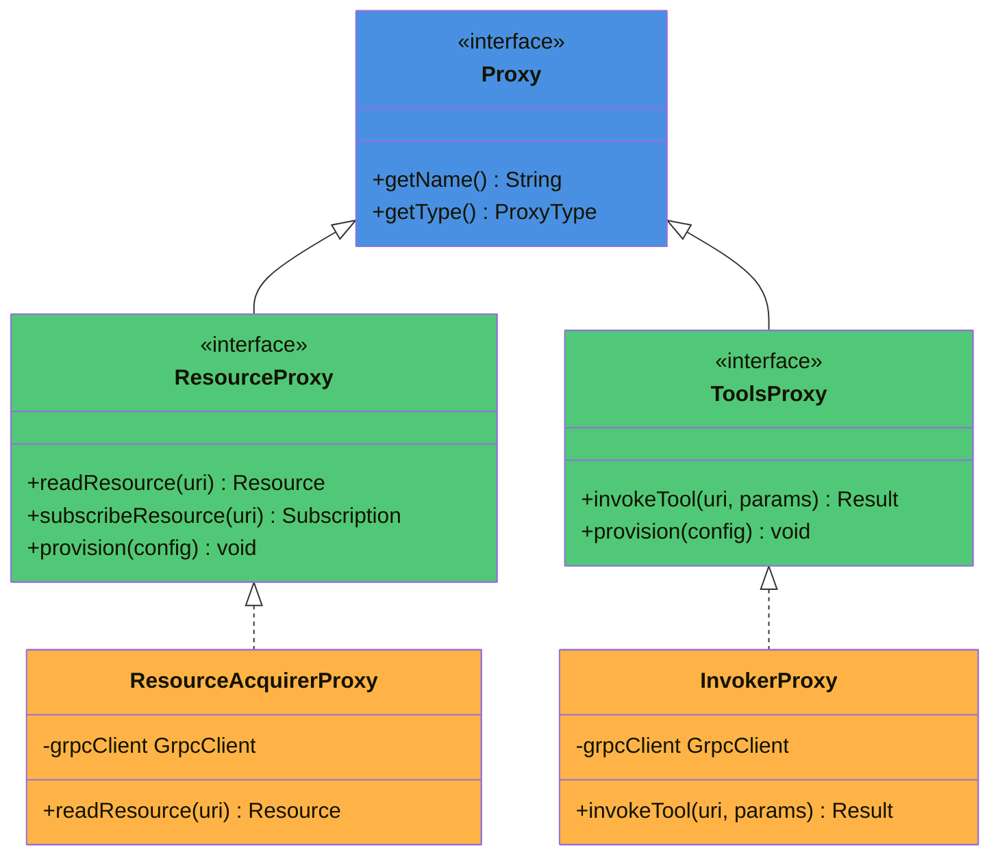
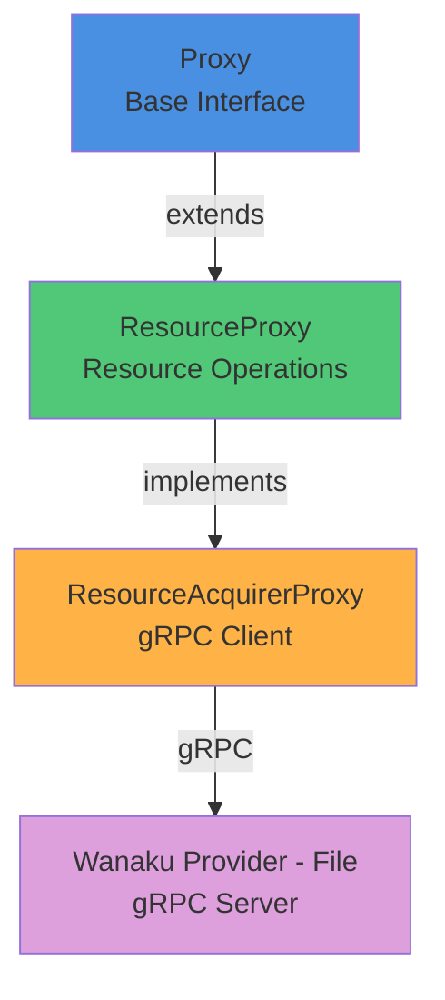
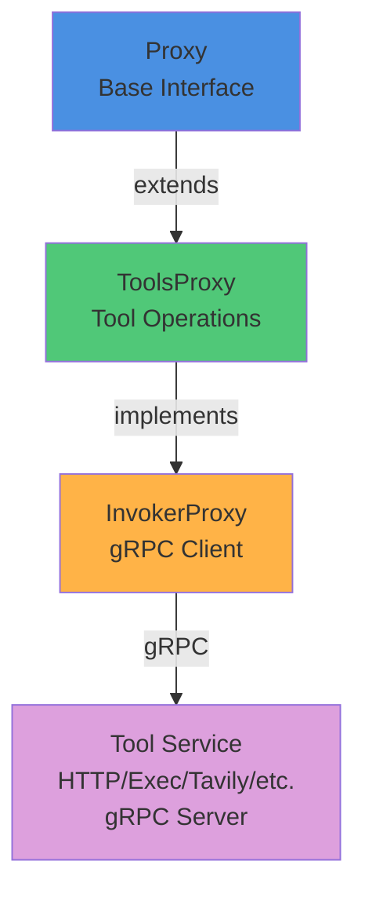
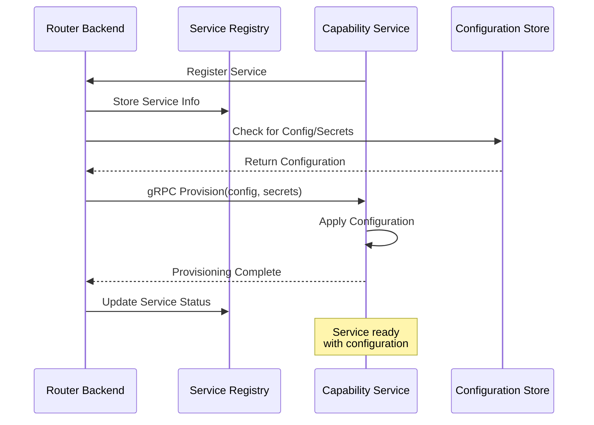
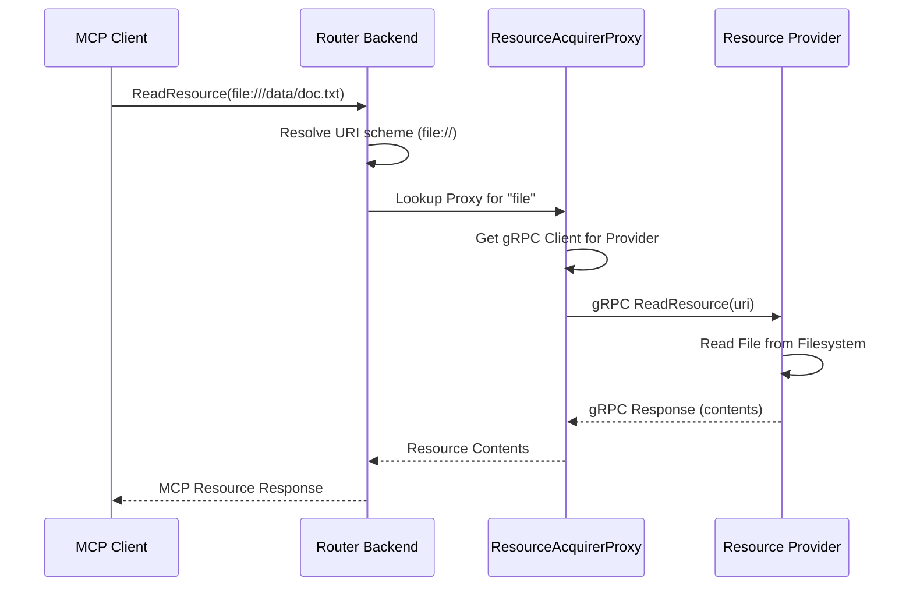
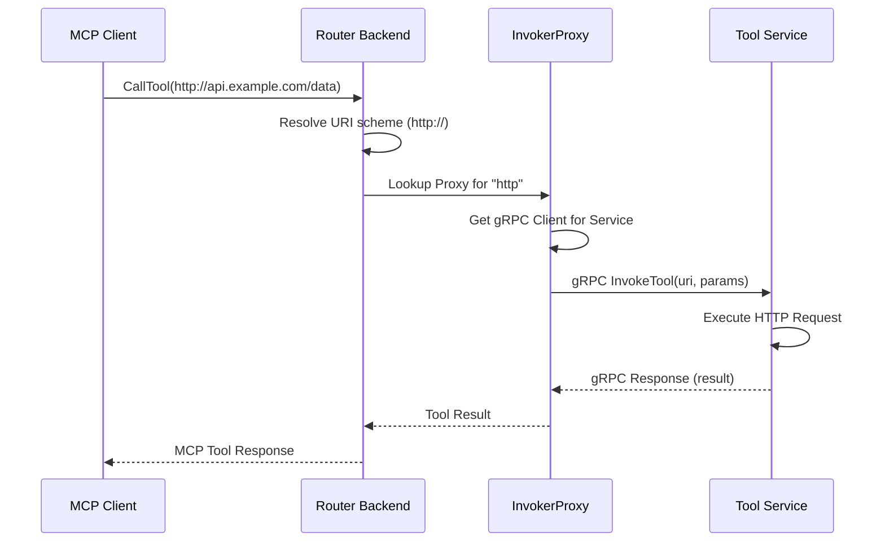

# Wanaku MCP Router Internals

This document provides a detailed look at the internal architecture and implementation of the Wanaku MCP Router backend.

## Overview

The Wanaku router backend is built around a proxy architecture that abstracts MCP operations and delegates actual work to capability services via gRPC.

### Core Abstraction: Proxy Interface

The root abstraction for all operations within Wanaku MCP Router is the [`Proxy`](https://github.com/wanaku-ai/wanaku/blob/main/wanaku-router-backend/src/main/java/ai/wanaku/backend/proxies/Proxy.java) interface. All MCP operations are executed by implementations of this interface.

### Proxy Hierarchy

The proxy architecture is organized into specialized interfaces:

* **[`ResourceProxy`](https://github.com/wanaku-ai/wanaku/blob/main/wanaku-router-backend/src/main/java/ai/wanaku/backend/proxies/ResourceProxy.java)** - Extended interface for resource-specific operations with provisioning and evaluation capabilities
* **[`ToolsProxy`](https://github.com/wanaku-ai/wanaku/blob/main/wanaku-router-backend/src/main/java/ai/wanaku/backend/proxies/ToolsProxy.java)** - Extended interface for tool-specific operations with provisioning capabilities

Leveraging these specialized interfaces, we have the concrete classes `ResourceAcquirerProxy` and `InvokerProxy` that use [gRPC](https://grpc.io/) to exchange data with capability services providing access to resources and tools.
 
## Resources 

A resource is, essentially, anything that can be read by using the MCP protocol. For instance: 

* Files
* Read-only JMS Queues 
* Topics
* Static resources (i.e.: a web page)

Among other things, resources can be subscribed to, so that changes to its data and state are notified
to the subscribers.

For instance, the ability to read files is handled by the `wanaku-provider-file` which is a gRPC server that is capable of
consuming files isolated from other providers:

Ideally, providers should leverage [Apache Camel](https://camel.apache.org/) whenever possible. 

## Tools

A tool is anything that can be invoked by an LLM in a request/response fashion and used to provide data to it. 

Examples: 

* Request/reply over JMS
* Calling REST APIs 
* Executing subprocesses that provide an output
* Executing an RPC invocation and waiting for its response

In Wanaku, every tool invocation is remote and handled by the `InvokerProxy` class which uses the gRPC protocol to
communicate with the service that provides the tool.

## Configuration and Secrets Provisioning System

Both resource providers and tool services support a provisioning system that handles configuration and secret management.

### Provisioning Flow

### Provisioning Capabilities

The provisioning system allows runtime configuration of services through gRPC-based provisioning requests that establish:

* **Configuration URIs**: Service-specific settings (endpoints, options, parameters)
* **Secret URIs**: Sensitive credentials (API keys, passwords, tokens)
* **Property Schemas**: Expected configuration structure and validation rules

### Benefits

- **Dynamic Configuration**: Update service settings without restarting services
- **Secure Credential Management**: Secrets delivered via encrypted gRPC channels
- **Schema Validation**: Ensure configuration correctness before deployment
- **Centralized Management**: Configuration managed through router backend
- **Flexible Deployment**: Support different configurations per environment

### Implementation Details

Provisioning is implemented through:

1. **gRPC Protocol**: Capability services implement the `ProvisioningService` gRPC interface
2. **Configuration Store**: Router backend stores tool/resource configurations in Infinispan
3. **Secret Integration**: Integration with Kubernetes Secrets or external secret managers
4. **Validation**: Schema-based validation ensures configuration correctness

## Component Interaction Patterns

### Resource Read Pattern

When an LLM requests a resource, the following interaction occurs:

### Tool Invocation Pattern

When an LLM invokes a tool, the interaction pattern is:

## Key Design Patterns

### Proxy Pattern

The router uses the Proxy pattern to:
- Provide a unified interface for MCP operations
- Abstract the complexity of gRPC communication
- Enable dynamic service discovery and routing
- Support provisioning and configuration management

### Factory Pattern

Service creation uses factories to:
- Instantiate appropriate proxy implementations based on URI schemes
- Manage gRPC client lifecycle
- Handle service registration and deregistration

### Strategy Pattern

Different capability types use strategy pattern to:
- Implement specific tool invocation logic
- Handle different resource types and protocols
- Apply different authentication mechanisms

## Thread Safety and Concurrency

### Concurrent Request Handling

- **Async Processing**: Router uses Quarkus reactive programming model
- **Thread Pools**: Dedicated thread pools for MCP requests and gRPC calls
- **Connection Pooling**: gRPC channels are pooled and reused
- **State Management**: Service registry uses concurrent data structures

### Isolation Guarantees

- **Request Isolation**: Each MCP request is processed independently
- **Service Isolation**: Capability services run in separate processes
- **Namespace Isolation**: Tools/resources in different namespaces don't interfere

## Related Documentation

- **[Architecture Overview](architecture.md)** - High-level system architecture and components
- **[Configuration Guide](configurations.md)** - Router and service configuration reference
- **[Contributing Guide](../CONTRIBUTING.md)** - How to extend Wanaku with new capabilities