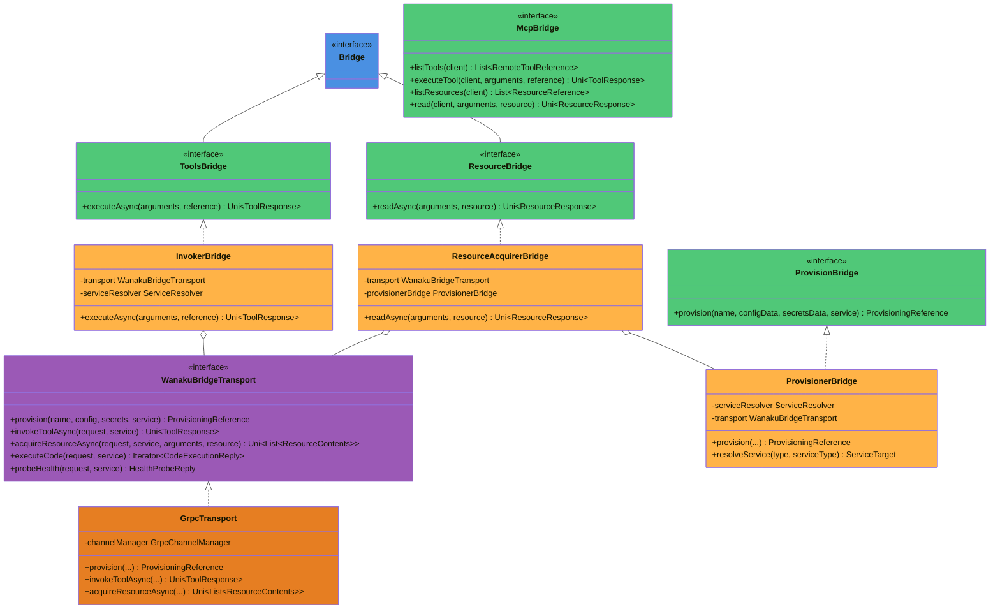
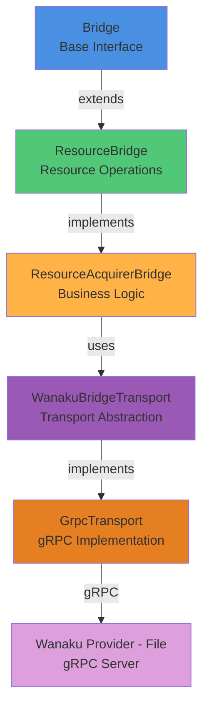
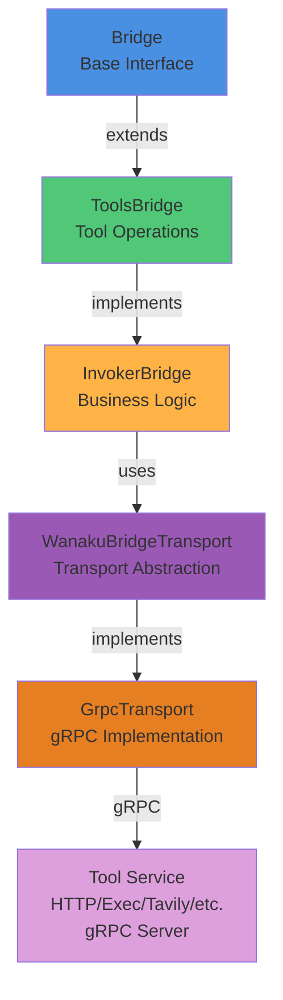
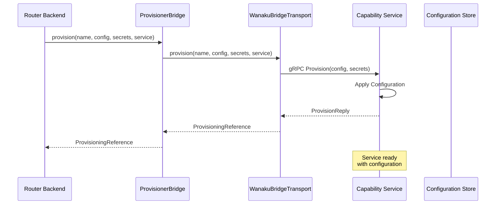
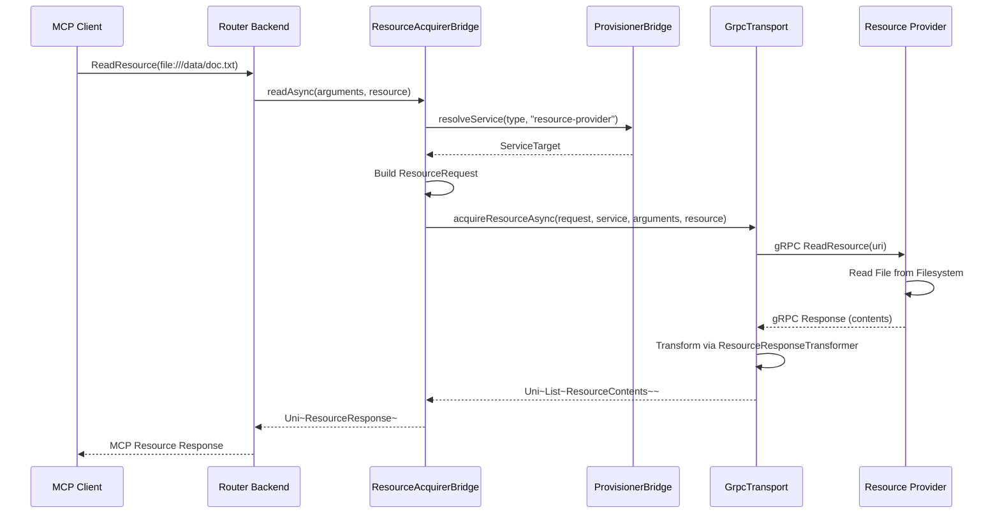
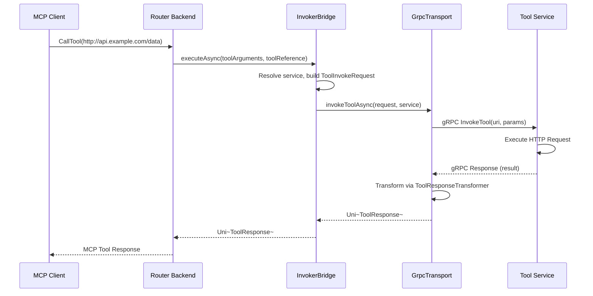

# Wanaku MCP Router Internals

This document provides a detailed look at the internal architecture and implementation of the Wanaku MCP Router backend.

## Overview

The Wanaku router backend is built around a bridge architecture that abstracts MCP operations and delegates actual work to capability services via gRPC. The bridge pattern separates transport concerns from business logic, enabling flexible and testable implementations.

### Core Abstraction: Bridge Interface

The root abstraction for all operations within Wanaku MCP Router is the [`Bridge`](https://github.com/wanaku-ai/wanaku/blob/main/wanaku-router-backend/src/main/java/ai/wanaku/backend/bridge/Bridge.java) interface. All MCP operations are executed by implementations of this interface.

### Bridge Hierarchy

```mermaid
classDiagram
    class Bridge {
        <<interface>>
    }

    class ResourceBridge {
        <<interface>>
        +readAsync(arguments, resource) Uni~ResourceResponse~
    }

    class ToolsBridge {
        <<interface>>
        +executeAsync(arguments, reference) Uni~ToolResponse~
    }

    class ProvisionBridge {
        <<interface>>
        +provision(name, configData, secretsData, service) ProvisioningReference
    }

    class McpBridge {
        <<interface>>
        +listTools(client) List~RemoteToolReference~
        +executeTool(client, arguments, reference) Uni~ToolResponse~
        +listResources(client) List~ResourceReference~
        +read(client, arguments, resource) Uni~ResourceResponse~
    }

    class WanakuBridgeTransport {
        <<interface>>
        +provision(name, config, secrets, service) ProvisioningReference
        +invokeToolAsync(request, service) Uni~ToolResponse~
        +acquireResourceAsync(request, service, arguments, resource) Uni~List~ResourceContents~~
        +executeCode(request, service) Iterator~CodeExecutionReply~
        +probeHealth(request, service) HealthProbeReply
    }

    class ResourceAcquirerBridge {
        -transport WanakuBridgeTransport
        -provisionerBridge ProvisionerBridge
        +readAsync(arguments, resource) Uni~ResourceResponse~
    }

    class InvokerBridge {
        -transport WanakuBridgeTransport
        -serviceResolver ServiceResolver
        +executeAsync(arguments, reference) Uni~ToolResponse~
    }

    class ProvisionerBridge {
        -serviceResolver ServiceResolver
        -transport WanakuBridgeTransport
        +provision(...) ProvisioningReference
        +resolveService(type, serviceType) ServiceTarget
    }

    class GrpcTransport {
        -channelManager GrpcChannelManager
        +provision(...) ProvisioningReference
        +invokeToolAsync(...) Uni~ToolResponse~
        +acquireResourceAsync(...) Uni~List~ResourceContents~~
    }

    Bridge <|-- ResourceBridge
    Bridge <|-- ToolsBridge
    ProvisionBridge <|.. ProvisionerBridge
    ResourceBridge <|.. ResourceAcquirerBridge
    ToolsBridge <|.. InvokerBridge
    WanakuBridgeTransport <|.. GrpcTransport
    ResourceAcquirerBridge o-- WanakuBridgeTransport
    ResourceAcquirerBridge o-- ProvisionerBridge
    InvokerBridge o-- WanakuBridgeTransport

    style Bridge fill:#4A90E2
    style ResourceBridge fill:#50C878
    style ToolsBridge fill:#50C878
    style ProvisionBridge fill:#50C878
    style McpBridge fill:#50C878
    style WanakuBridgeTransport fill:#9B59B6
    style ResourceAcquirerBridge fill:#FFB347
    style InvokerBridge fill:#FFB347
    style ProvisionerBridge fill:#FFB347
    style GrpcTransport fill:#E67E22
```

The bridge architecture is organized into specialized interfaces and uses composition over inheritance:

* **[`Bridge`](https://github.com/wanaku-ai/wanaku/blob/main/wanaku-router-backend/src/main/java/ai/wanaku/backend/bridge/Bridge.java)** - Base marker interface for all bridge implementations
* **[`ResourceBridge`](https://github.com/wanaku-ai/wanaku/blob/main/wanaku-router-backend/src/main/java/ai/wanaku/backend/bridge/ResourceBridge.java)** - Extended interface for asynchronous resource reading
* **[`ToolsBridge`](https://github.com/wanaku-ai/wanaku/blob/main/wanaku-router-backend/src/main/java/ai/wanaku/backend/bridge/ToolsBridge.java)** - Extended interface for asynchronous tool execution
* **[`ProvisionBridge`](https://github.com/wanaku-ai/wanaku/blob/main/wanaku-router-backend/src/main/java/ai/wanaku/backend/bridge/ProvisionBridge.java)** - Interface for provisioning configuration and secrets to remote services
* **[`McpBridge`](https://github.com/wanaku-ai/wanaku/blob/main/wanaku-router-backend/src/main/java/ai/wanaku/backend/bridge/McpBridge.java)** - Interface for interacting with remote MCP servers (forwarding)
* **[`WanakuBridgeTransport`](https://github.com/wanaku-ai/wanaku/blob/main/wanaku-router-backend/src/main/java/ai/wanaku/backend/bridge/WanakuBridgeTransport.java)** - Transport abstraction interface that decouples protocol from business logic, with async-first operations and built-in response transformation

### Transport Abstraction

The bridge architecture uses **composition over inheritance** to separate transport concerns from business logic:

* **`ResourceAcquirerBridge`** and **`InvokerBridge`** delegate all transport operations to a `WanakuBridgeTransport` implementation
* **`GrpcTransport`** implements `WanakuBridgeTransport` and handles all gRPC-specific communication
* **`ProvisionerBridge`** consolidates shared provisioning logic and service resolution, eliminating duplication between bridges
* **Response transformers** (`ToolResponseTransformer`, `ResourceResponseTransformer`) convert transport-specific types (e.g., gRPC protobuf replies) into MCP domain types within the transport layer, keeping bridge implementations protocol-agnostic
* This design enables:
  - Easy testing with mock transports
  - Support for alternative transport protocols (HTTP, WebSocket, etc.)
  - Clear separation between routing logic and communication details
  - Independent evolution of transport and business logic

All bridge operations follow an **async-first** design using Mutiny `Uni` types. The transport layer returns already-transformed domain objects, so bridges never handle transport-specific types directly.

Leveraging these specialized interfaces, we have the concrete classes `ResourceAcquirerBridge` and `InvokerBridge` that use [gRPC](https://grpc.io/) via the transport abstraction to exchange data with capability services providing access to resources and tools. Additionally, `DefaultMcpBridge` provides forwarding to remote MCP servers using the langchain4j MCP client.
 
## Resources 

A resource is, essentially, anything that can be read by using the MCP protocol. For instance: 

* Files
* Read-only JMS Queues 
* Topics
* Static resources (i.e.: a web page)

Among other things, resources can be subscribed to, so that changes to its data and state are notified
to the subscribers.

For instance, the ability to read files is handled by the `wanaku-provider-file` which is a gRPC server that is capable of
consuming files isolated from other providers:

```mermaid
graph TB
    Bridge[Bridge<br/>Base Interface]
    ResourceBridge[ResourceBridge<br/>Resource Operations]
    ResourceAcquirerBridge[ResourceAcquirerBridge<br/>Business Logic]
    Transport[WanakuBridgeTransport<br/>Transport Abstraction]
    GrpcTransport[GrpcTransport<br/>gRPC Implementation]
    FileProvider[Wanaku Provider - File<br/>gRPC Server]

    Bridge -->|extends| ResourceBridge
    ResourceBridge -->|implements| ResourceAcquirerBridge
    ResourceAcquirerBridge -->|uses| Transport
    Transport -->|implements| GrpcTransport
    GrpcTransport -->|gRPC| FileProvider

    style Bridge fill:#4A90E2
    style ResourceBridge fill:#50C878
    style ResourceAcquirerBridge fill:#FFB347
    style Transport fill:#9B59B6
    style GrpcTransport fill:#E67E22
    style FileProvider fill:#DDA0DD
```

Ideally, providers should leverage [Apache Camel](https://camel.apache.org/) whenever possible. 

## Tools

A tool is anything that can be invoked by an LLM in a request/response fashion and used to provide data to it. 

Examples: 

* Request/reply over JMS
* Calling REST APIs 
* Executing subprocesses that provide an output
* Executing an RPC invocation and waiting for its response

In Wanaku, every tool invocation is remote and handled by the `InvokerBridge` class which uses the gRPC protocol via the transport abstraction to
communicate with the service that provides the tool.

```mermaid
graph TB
    Bridge[Bridge<br/>Base Interface]
    ToolsBridge[ToolsBridge<br/>Tool Operations]
    InvokerBridge[InvokerBridge<br/>Business Logic]
    Transport[WanakuBridgeTransport<br/>Transport Abstraction]
    GrpcTransport[GrpcTransport<br/>gRPC Implementation]
    ToolProvider[Tool Service<br/>HTTP/Exec/Tavily/etc.<br/>gRPC Server]

    Bridge -->|extends| ToolsBridge
    ToolsBridge -->|implements| InvokerBridge
    InvokerBridge -->|uses| Transport
    Transport -->|implements| GrpcTransport
    GrpcTransport -->|gRPC| ToolProvider

    style Bridge fill:#4A90E2
    style ToolsBridge fill:#50C878
    style InvokerBridge fill:#FFB347
    style Transport fill:#9B59B6
    style GrpcTransport fill:#E67E22
    style ToolProvider fill:#DDA0DD
```

## Configuration and Secrets Provisioning System

Both resource providers and tool services support a provisioning system that handles configuration and secret management. Provisioning logic is consolidated in the `ProvisionerBridge` class, which eliminates duplication between `InvokerBridge` and `ResourceAcquirerBridge`.

### Provisioning Flow

```mermaid
sequenceDiagram
    participant Router as Router Backend
    participant PB as ProvisionerBridge
    participant Transport as WanakuBridgeTransport
    participant Service as Capability Service
    participant ConfigStore as Configuration Store

    Router->>PB: provision(name, config, secrets, service)
    PB->>Transport: provision(name, config, secrets, service)
    Transport->>Service: gRPC Provision(config, secrets)
    Service->>Service: Apply Configuration
    Service-->>Transport: ProvisionReply
    Transport-->>PB: ProvisioningReference
    PB-->>Router: ProvisioningReference

    Note over Service: Service ready<br/>with configuration
```

### Provisioning Capabilities

The provisioning system allows runtime configuration of services through gRPC-based provisioning requests that establish:

* **Configuration URIs**: Service-specific settings (endpoints, options, parameters)
* **Secret URIs**: Sensitive credentials (API keys, passwords, tokens)
* **Property Schemas**: Expected configuration structure and validation rules

### Benefits

- **Dynamic Configuration**: Update service settings without restarting services
- **Secure Credential Management**: Secrets delivered via encrypted gRPC channels
- **Schema Validation**: Ensure configuration correctness before deployment
- **Centralized Management**: Configuration managed through router backend
- **Flexible Deployment**: Support different configurations per environment

### Implementation Details

Provisioning is implemented through:

1. **`ProvisionerBridge`**: Consolidates provisioning logic and service resolution, shared by both tool and resource bridges
2. **gRPC Protocol**: Capability services implement the `Provisioner` gRPC interface
3. **Configuration Store**: Router backend stores tool/resource configurations in Infinispan
4. **Secret Integration**: Integration with Kubernetes Secrets or external secret managers
5. **Validation**: Schema-based validation ensures configuration correctness

## Component Interaction Patterns

### Resource Read Pattern

When an LLM requests a resource, the following interaction occurs:

```mermaid
sequenceDiagram
    participant MCP as MCP Client
    participant Router as Router Backend
    participant RAB as ResourceAcquirerBridge
    participant PB as ProvisionerBridge
    participant Transport as GrpcTransport
    participant Provider as Resource Provider

    MCP->>Router: ReadResource(file:///data/doc.txt)
    Router->>RAB: readAsync(arguments, resource)
    RAB->>PB: resolveService(type, "resource-provider")
    PB-->>RAB: ServiceTarget
    RAB->>RAB: Build ResourceRequest
    RAB->>Transport: acquireResourceAsync(request, service, arguments, resource)
    Transport->>Provider: gRPC ReadResource(uri)
    Provider->>Provider: Read File from Filesystem
    Provider-->>Transport: gRPC Response (contents)
    Transport->>Transport: Transform via ResourceResponseTransformer
    Transport-->>RAB: Uni~List~ResourceContents~~
    RAB-->>Router: Uni~ResourceResponse~
    Router-->>MCP: MCP Resource Response
```

### Tool Invocation Pattern

When an LLM invokes a tool, the interaction pattern is:

```mermaid
sequenceDiagram
    participant MCP as MCP Client
    participant Router as Router Backend
    participant IB as InvokerBridge
    participant Transport as GrpcTransport
    participant Tool as Tool Service

    MCP->>Router: CallTool(http://api.example.com/data)
    Router->>IB: executeAsync(toolArguments, toolReference)
    IB->>IB: Resolve service, build ToolInvokeRequest
    IB->>Transport: invokeToolAsync(request, service)
    Transport->>Tool: gRPC InvokeTool(uri, params)
    Tool->>Tool: Execute HTTP Request
    Tool-->>Transport: gRPC Response (result)
    Transport->>Transport: Transform via ToolResponseTransformer
    Transport-->>IB: Uni~ToolResponse~
    IB-->>Router: Uni~ToolResponse~
    Router-->>MCP: MCP Tool Response
```

## Key Design Patterns

### Bridge Pattern

The router uses the Bridge pattern to:
- Separate abstraction (business logic) from implementation (transport)
- Provide a unified interface for MCP operations
- Enable composition over inheritance for flexibility
- Support multiple transport implementations (gRPC, HTTP, etc.)
- Facilitate testing with mock transports

### Composition Over Inheritance

The architecture favors composition:
- Bridges **have-a** transport instead of **being-a** transport
- `InvokerBridge` and `ResourceAcquirerBridge` delegate to `WanakuBridgeTransport`
- `GrpcTransport` implements transport-specific logic
- Clear separation enables independent evolution of components

### Factory Pattern

Service creation uses factories to:
- Instantiate appropriate proxy implementations based on URI schemes
- Manage gRPC client lifecycle
- Handle service registration and deregistration

### Strategy Pattern

Different capability types use strategy pattern to:
- Implement specific tool invocation logic
- Handle different resource types and protocols
- Apply different authentication mechanisms

## Thread Safety and Concurrency

### Concurrent Request Handling

- **Async Processing**: Router uses Quarkus reactive programming model
- **Thread Pools**: Dedicated thread pools for MCP requests and gRPC calls
- **Connection Pooling**: gRPC channels are pooled and reused
- **State Management**: Service registry uses concurrent data structures

### Isolation Guarantees

- **Request Isolation**: Each MCP request is processed independently
- **Service Isolation**: Capability services run in separate processes
- **Namespace Isolation**: Tools/resources in different namespaces don't interfere

## Related Documentation

- **[Persistence](internals-persistence.md)** - Persistence information
- **[Service Registration](internals-service-registration.md)** - Service registration information
- **[Architecture Overview](architecture.md)** - High-level system architecture and components
- **[Configuration Guide](configurations.md)** - Router and service configuration reference
- **[Contributing Guide](../CONTRIBUTING.md)** - How to extend Wanaku with new capabilities